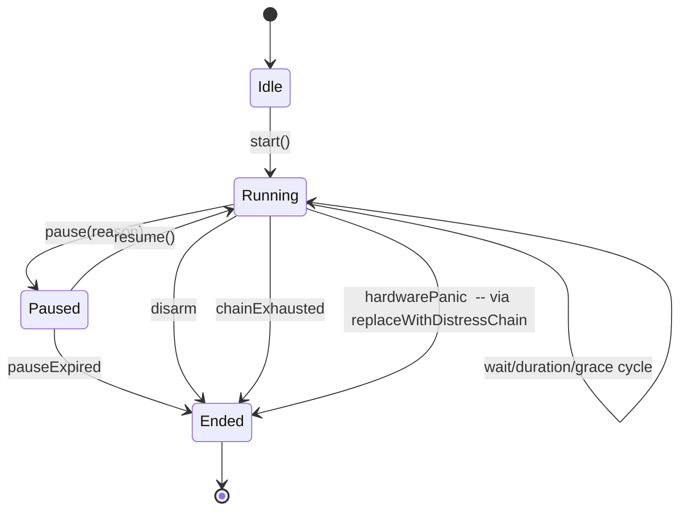

> **Normative status:** This document is NORMATIVE for architecture. In
> case of conflict with narrative documents (rebuild-strategy,
> decisions-log, reviews), this document takes precedence for questions
> of WHERE code lives, WHICH layer owns which responsibility, and HOW
> components are wired together. The feature-behaviour specs in
> `docs/spec/` remain authoritative for WHAT each feature does; this
> document answers the structural companion question: HOW is that
> behaviour expressed in code.
>
> Key words MUST / SHOULD / MAY follow RFC 2119.

# Guardian Angela — Architectural Implementation Sketch

## 1. Executive summary

This document describes the concrete architecture of the Guardian Angela
Flutter application as it will exist after the rewrite ("v7"). It is a
structural blueprint: it names every layer, every directory, every
component (models, engine, strategies, services, repositories, screens,
controllers, routers, platform channels) and spells out the dependency
rules and wiring contract that hold them together. The intent is that an
engineer starting from an empty folder can use this document — together
with the normative `docs/spec/*` behaviour specs, the `docs/decisions-log.md`
architectural decisions, the `docs/test-strategy.md` verification plan,
and the `docs/rebuild-strategy.md` phasing plan — to produce an
implementation that is unambiguous in shape.

The architecture honours five top-level choices made by the product
owner: **Drift (SQLite) with sqlcipher for encrypted local storage**,
**Riverpod for state management**, **GoRouter for navigation**,
**iOS 17+ / Android 8 (API 26)+ as OS floors**, and **14 languages at
launch**. It targets **99%+ line coverage** via `flutter_test`, with
end-to-end coverage layered from **Patrol** (Flutter-aware), **Maestro**
(declarative flows) and **Appium** (black-box native), and **golden
tests for every widget** via `golden_toolkit`.

---

## 2. Architectural layers

The application is structured as six stacked layers. Arrows point only
**down** the stack: a higher layer MAY depend on a lower one; a lower
layer MUST NOT import from any layer above it.

```
 +-------------------------------------------------+
 |  UI Layer: Screens + Widgets                    |
 |  (Flutter widgets, Riverpod ConsumerWidgets,    |
 |   route bodies, themed MaterialApp)             |
 +-------------------------------------------------+
 |  Presentation: Riverpod Controllers             |
 |  (AsyncNotifier/Notifier, UI state holders,     |
 |   bridge between widgets and Domain)            |
 +-------------------------------------------------+
 |  Domain: Engine + Orchestration + Models        |
 |  (pure Dart: SessionEngine state machine,       |
 |   EventStrategyRegistry + 9 strategies,         |
 |   data classes, validators). NO Flutter imports |
 +-------------------------------------------------+
 |  Data: Repositories + Drift Database            |
 |  (Drift AppDatabase + DAOs + schema tables,     |
 |   thin repository wrappers exposing Streams)    |
 +-------------------------------------------------+
 |  Services: Platform integrations                |
 |  (Protocol interfaces + Real + Fake + Simulation|
 |   implementations for audio, SMS, phone, GPS,   |
 |   notifications, vibration, battery, hardware)  |
 +-------------------------------------------------+
 |  Platform: Android + iOS native                 |
 |  (Kotlin MainActivity + channels, Swift plugins,|
 |   foreground service, widget extension)         |
 +-------------------------------------------------+
```

### 2.1 Dependency rules (enforced by `dart_code_metrics` + import linter)

| Layer | MAY import | MUST NOT import |
|-------|------------|-----------------|
| UI | Presentation, Core | Data, Services (except via providers), Platform native code |
| Presentation | Domain, Services (via protocol), Data (via repository) | `package:flutter/widgets.dart` except `WidgetsBinding` lifecycle hooks |
| Domain | `dart:*` only | `package:flutter`, `package:drift`, `package:hive*`, any service implementation |
| Data | `package:drift`, Domain models, `dart:*` | Services, Presentation, UI |
| Services (protocols) | Domain models only | Flutter widgets, Drift |
| Services (impls) | Their own protocol, platform channels, `package:*` | Presentation, UI |
| Platform (Kotlin/Swift) | Android/iOS SDK + Flutter engine | n/a |

### 2.2 "Where does this logic go?" rules of thumb

- **"It calls a platform API" → Services** (with a protocol in
  `services/protocols/` and one or more implementations). Never
  directly in Domain or Presentation.
- **"It decides WHEN an action fires" → Domain** (SessionEngine, or
  TriggerManager).
- **"It decides WHAT action fires for step type X" → Domain
  orchestration** (EventStrategy).
- **"It reads/writes persistent data" → Data** (repository method).
  Always returns a Stream for watched data.
- **"It holds UI-only state (expanded panels, draft forms)" →
  Presentation** controller.
- **"It is a reusable piece of UI" → `lib/core/widgets/`.**
- **"It is a one-off piece of UI for a feature" → `lib/features/<feat>/widgets/`.**

### 2.3 Forbidden patterns (enforced by CI grep checks)

- `print(` / `debugPrint(` anywhere (use `dart:developer` `log()`).
- `package:flutter` import inside `lib/domain/`.
- `SessionController` or any controller constructing a service impl
  directly (only Riverpod providers may construct impls). See
  `docs/rebuild-strategy.md` L14.
- `Hive.` or `.openBox(` anywhere (Drift replaces Hive).
- Direct use of `DateTime.now()` in Domain (inject `Clock`).
- Direct use of `Random()` in Domain (inject `Random`).

---

## 3. Directory layout

The rewrite produces the following tree. Every directory has a 1-line
purpose. File counts in parentheses are indicative, not binding.

```
lib/
|-- main.dart                          # runApp bootstrap, DI container init
|-- app.dart                           # MaterialApp.router + ThemeData + localization
|-- core/
|   |-- constants/                     # route names, feature flags, step helpers
|   |-- theme/                         # AppColors, AppTypography, ThemeExtension<SafetyColors>
|   |-- utils/                         # phone validators, biometric helper, hash utils
|   |-- widgets/                       # reusable low-level widgets (PinKeypad, SwipeSlider, LogarithmicSlider)
|   `-- errors/                        # AppException hierarchy + error formatters
|-- domain/
|   |-- engine/
|   |   |-- session_engine.dart        # pure Dart state machine
|   |   |-- engine_state.dart          # sealed EngineState hierarchy
|   |   |-- chain_event.dart           # ChainEvent enum + ChainEventData class
|   |   |-- timer_phase.dart           # TimerPhase enum
|   |   |-- trigger_manager.dart       # disarm + distress trigger dispatcher
|   |   `-- session_log_recorder.dart  # pure Dart log accumulator (no I/O)
|   |-- orchestration/
|   |   |-- session_orchestrator.dart  # wires engine events -> strategies
|   |   |-- event_strategy.dart        # abstract EventStrategy
|   |   |-- event_strategy_registry.dart # sealed-switch registry
|   |   |-- session_context.dart       # immutable bundle of session-scoped data
|   |   |-- event_services.dart        # bundle of injected services
|   |   `-- strategies/                # 9 strategy files
|   |-- models/                        # all persistent + transient data classes
|   `-- validation/                    # SessionValidator, input validators
|-- data/
|   |-- database.dart                  # AppDatabase extends _$AppDatabase
|   |-- schema/                        # per-table Drift classes
|   |-- daos/                          # per-table DAO classes
|   |-- migrations/                    # one file per schema version bump
|   |-- encryption/                    # QueryExecutor factory using sqlcipher
|   |-- seed_data.dart                 # built-in modes, templates, event defaults
|   `-- repositories/                  # thin stream-exposing wrappers over DAOs
|-- services/
|   |-- protocols/                     # abstract class per service
|   |-- implementations/               # real platform impls
|   |-- fakes/                         # in-memory fakes for tests
|   |-- simulation/                    # simulation impls (block I/O, toast only)
|   `-- service_providers.dart         # Riverpod providers wiring everything up
|-- features/
|   |-- onboarding/                    # 3-page flow (welcome / profile+contact / permissions)
|   |-- home/                          # HomeScreen (session launcher)
|   |-- modes/                         # mode list, mode editor
|   |-- session/                       # SessionScreen, SessionController, simulation summary
|   |-- fake_call/                     # FakeCallScreen + controller
|   |-- contacts/                      # contact list, contact form
|   |-- history/                       # past event list, detail, evidence export
|   |-- templates/                     # reminder templates list + editor
|   |-- settings/
|   |   |-- settings_screen.dart       # top-level hub (Theme + Language + subcategory rows)
|   |   |-- security_settings_screen.dart
|   |   |-- stealth_settings_screen.dart
|   |   |-- gps_logging_settings_screen.dart
|   |   |-- event_defaults_screen.dart
|   |   |-- notification_settings_screen.dart
|   |   |-- history_retention_screen.dart
|   |   |-- battery_alert_screen.dart
|   |   |-- distress_chain_screen.dart
|   |   |-- backup_screen.dart
|   |   |-- pin_setup_screen.dart
|   |   `-- settings_controller.dart
|   |-- profile/                       # user profile editor
|   |-- about/                         # version + license + acknowledgements
|   `-- feedback/                      # feedback submission
|-- router/
|   |-- app_router.dart                # single GoRouter instance
|   `-- redirect_logic.dart            # first-launch / PIN-gate redirect rules
`-- l10n/
    |-- l10n/                          # ARB source files (14 languages)
    `-- (generated classes)

test/
|-- helpers/                           # factories, FixedRandom, ClockHelper, fixtures
|-- domain/                            # unit tests for models, engine, strategies
|   |-- engine/
|   |-- orchestration/
|   |-- models/
|   `-- validation/
|-- data/                              # repository + schema + migration tests
|-- services/                          # contract tests (one test suite run against real + fake + simulation impls)
|-- features/                          # controller + widget tests per feature
|-- integration/                       # end-to-end flows with fakes (fakeAsync)
|-- regression/                        # one file per historical bug
|-- property/                          # property/fuzz tests
|-- wiring/                            # "every field threads through" assertions
|-- goldens/                           # golden baselines (generated)
`-- e2e/                               # patrol + maestro + appium scripts

integration_test/                      # patrol entry points
maestro/                               # .yaml maestro flows
appium/                                # Python Appium test scripts
```

---

## 4. Domain layer in detail

The domain layer is the heart of the app and the ONLY layer that is
free of Flutter and platform dependencies. Every file in `lib/domain/`
MUST be runnable under a plain `dart test` without a Flutter binding.

### 4.1 Engine

#### Public surface

```dart
/// Pure Dart state machine driving the safety session lifecycle.
///
/// Holds no Flutter state and performs no I/O. Emits ChainEventData
/// via a broadcast stream; listeners (the orchestrator, the controller)
/// perform side-effects.
final class SessionEngine {
  SessionEngine({
    required SessionMode mode,
    required DistressChain distressChain,
    required this.random,
    required this.clock,
    this.speedMultiplier = 1.0,
    this.isSimulation = false,
  });

  final Random random;              // jitter source, injectable for tests
  final DateTime Function() clock;  // time source, injectable for tests
  final double speedMultiplier;     // simulation-only; engine REJECTS >1.0 unless isSimulation=true
  final bool isSimulation;

  Stream<ChainEventData> get events;   // broadcast, sync:true (deterministic)
  EngineState get state;

  Future<void> start();
  Future<void> endSession({required EndReason reason});
  void holdStart();                 // holdButton press
  void holdRelease();               // holdButton release
  Future<void> disarm();            // "I'm safe" universal disarm
  Future<void> earlyCheckIn();      // disguisedReminder tap-through
  void answerFakeCall();
  void hangUp();
  void restartCurrentStep();
  Future<void> advanceFromHardwarePanic();   // hardware panic button
  Future<void> jumpToStep(int index);        // dev/tester only
  void pause({required PauseReason reason});
  void resume();
  void leapToNextEvent();           // simulation-only skip
  void setSpeedMultiplier(double v);// simulation-only
  Future<void> replaceWithDistressChain(); // wrong-PIN, duress PIN, panic trigger
}
```

#### Sealed state hierarchy

```dart
sealed class EngineState {}
final class EngineIdle extends EngineState {}
final class EngineRunning extends EngineState {
  int currentStepIndex;
  int missedRepeats;
  TimerPhase phase;
  DateTime phaseStartedAt;
  Duration phaseDuration;
}
final class EnginePaused extends EngineState {
  EngineRunning suspendedFrom;
  PauseReason reason;
  DateTime pausedAt;
  Duration? maxDuration;
}
final class EngineEnded extends EngineState {
  EndReason reason;
  DateTime endedAt;
}

enum EndReason { disarm, chainExhausted, hardwarePanic, appTermination, duressPin, wrongPinExhausted, userQuit }
enum PauseReason { incomingCall, bootRestart, userRequested }
```

#### ChainEvent enum (11 values)

```dart
enum ChainEvent {
  stepStarted,
  reminderFired,
  repeatMissed,
  stepAdvancing,
  userDisarmed,
  chainExhausted,
  sessionEnded,
  sessionPaused,
  sessionResumed,
  pauseExpired,
  stepExecutionFailed,
}

/// Fully-specified event payload.
class ChainEventData {
  final ChainEvent event;
  final int stepIndex;
  final ChainStep step;
  final TimerPhase phase;
  final int retryIteration; // 0 = first execution
  final Object? payload;    // strategy-specific extras
  final DateTime occurredAt;
  const ChainEventData({...});
}
```

#### TimerPhase

```dart
enum TimerPhase { wait, duration, grace, sensitivity, holdWait }
```

`sensitivity` applies to hardware-panic long-press; `holdWait` covers
the pre-release confirmation window for holdButton.

#### State transition diagram

```
            +------------+
            | EngineIdle |
            +-----+------+
                  | start()
                  v
            +------------+   pause()     +--------------+
            | EngineRun  |-------------->| EnginePaused |
    start   +-----+------+               +------+-------+
    of step       |  ^                          | resume() /
      (wait)      |  | resume                   | pauseExpired
                  v  |                          v
       wait->duration->grace cycle -----> back to running
                  |
      grace expires -> miss++
      if miss > retryCount: advance
      if last step: chainExhausted
                  |
                  v
            +------------+
            | EngineEnded|
            +------------+
```

**Invariants** (asserted at each state-change):
- From Idle, only `start()` may fire.
- From Ended, no input alters state (all input ignored, a DEBUG log is
  emitted).
- `stepAdvancing` always follows `repeatMissed` that reaches
  `retryCount` OR immediately after successful `holdRelease`.
- `replaceWithDistressChain()` is idempotent once the chain has been
  replaced; the engine's `_chainReplaced` flag guards re-entry.

### 4.2 Orchestration

The orchestrator is a thin adapter that listens to the engine and
routes each event to the correct strategy.

#### SessionOrchestrator

```dart
final class SessionOrchestrator {
  SessionOrchestrator({
    required this.engine,
    required this.registry,
    required this.services,
    required this.context,
  });

  final SessionEngine engine;
  final EventStrategyRegistry registry;
  final EventServices services;
  final SessionContext context;

  StreamSubscription<ChainEventData>? _sub;

  void attach() {
    _sub = engine.events.listen(_dispatch);
  }

  Future<void> detach() async { await _sub?.cancel(); }

  Future<void> _dispatch(ChainEventData data) async {
    final strategy = registry.forStep(data.step.type);
    try {
      if (context.isSimulation) {
        services.notification.showToast(strategy.simulationDescription(data.step));
      } else {
        await strategy.executeReal(data, services);
      }
    } on Object catch (e, st) {
      log('Strategy ${data.step.type} failed', error: e, stackTrace: st);
      engine.emitFailure(data, e); // -> stepExecutionFailed event on stream
    }
  }
}
```

#### EventStrategyRegistry (sealed/exhaustive)

Rather than a `Map<ChainStepType, EventStrategy>` which a runtime test
has to verify, the registry is implemented as a `switch` expression
over the enum. This gets compile-time exhaustiveness checking and
eliminates L9 ("registry missing 3 of 9 strategies").

```dart
final class EventStrategyRegistry {
  EventStrategyRegistry({required this.strategies});
  final Map<ChainStepType, EventStrategy> strategies;

  EventStrategy forStep(ChainStepType type) => switch (type) {
    ChainStepType.holdButton => strategies[type] ?? (throw StateError('...')),
    ChainStepType.disguisedReminder => ...,
    ChainStepType.hardwareButton => ...,
    ChainStepType.countdownWarning => ...,
    ChainStepType.fakeCall => ...,
    ChainStepType.smsContact => ...,
    ChainStepType.phoneCallContact => ...,
    ChainStepType.loudAlarm => ...,
    ChainStepType.callEmergency => ...,
  };
}
```

A golden exhaustiveness unit test iterates the enum and invokes
`forStep`, asserting no throw for any value.

#### The 9 strategies

Each strategy lives in its own file under
`lib/domain/orchestration/strategies/` and implements:

```dart
abstract interface class EventStrategy {
  Future<void> executeReal(ChainEventData event, EventServices services);
  String simulationDescription(ChainStep step);
}
```

The 9:

| Strategy | Step type | Reads services | Emits |
|----------|-----------|----------------|-------|
| `HoldButtonStrategy` | holdButton | (none) | engine state only |
| `DisguisedReminderStrategy` | disguisedReminder | notification | reminderFired |
| `HardwareButtonStrategy` | hardwareButton | hardwareButton | advances chain |
| `CountdownWarningStrategy` | countdownWarning | vibration, audio | visual cue |
| `FakeCallStrategy` | fakeCall | audio, incomingCall | ringtone loop |
| `SmsContactStrategy` | smsContact | messaging, location | SMS per contact |
| `PhoneCallContactStrategy` | phoneCallContact | phone, messaging | dial out |
| `LoudAlarmStrategy` | loudAlarm | audio, vibration | alarm sound |
| `CallEmergencyStrategy` | callEmergency | phone, messaging | dial E-number |

### 4.3 SessionContext + EventServices

`SessionContext` is an **immutable** snapshot of session-scoped data
passed to every strategy invocation. Constructed at session start from
settings + mode + profile + contacts. Copy-on-write only.

```dart
final class SessionContext {
  const SessionContext({
    required this.emergencyNumber,
    required this.contacts,
    required this.templates,
    required this.profile,
    required this.stealth,
    required this.gpsLogging,
    required this.isSimulation,
    required this.mode,
    required this.distressChain,
  });

  final String emergencyNumber;
  final List<EmergencyContact> contacts;
  final List<ReminderTemplate> templates;
  final UserProfile profile;
  final StealthConfig stealth;
  final GpsLoggingConfig gpsLogging;
  final bool isSimulation;
  final SessionMode mode;
  final DistressChain distressChain;
}
```

`EventServices` is a **bundle** of live service references +
callbacks. The bundle is mutable via `isCancelled` and the
`registerSmsWorkId` callback (for retry tracking).

```dart
final class EventServices {
  final AudioService audio;
  final VibrationService vibration;
  final MessagingService messaging;
  final PhoneService phone;
  final LocationService location;
  final NotificationService notification;
  final HardwareButtonService hardwareButton;
  final IncomingCallService incomingCall;
  final SessionContext context;
  final bool Function() isCancelled;
  final void Function(String workId) registerSmsWorkId;
}
```

### 4.4 Models

All persistent and transient models live in `lib/domain/models/`. Each
model is:
- **Immutable** (`final class`, all fields `final`).
- Has a `copyWith`.
- Has `==` / `hashCode` (via `package:equatable` OR hand-written via
  `Object.hashAll`).
- Serializable: `fromJson` + `toJson` (for backup export / import
  round-trip tests).
- Bridges to Drift via a `fromDrift(DriftRow r)` factory and
  `toDrift() => DriftCompanion(...)` method placed in the same file.

#### 9 ChainStepTypes

`holdButton`, `disguisedReminder`, `hardwareButton`, `countdownWarning`,
`fakeCall`, `smsContact`, `phoneCallContact`, `loudAlarm`,
`callEmergency`.

#### StepConfig sealed hierarchy (compile-time safe)

```dart
sealed class StepConfig {
  const StepConfig();
}

final class HoldButtonConfig extends StepConfig {
  final int countdownSeconds;
  const HoldButtonConfig({...});
}

final class DisguisedReminderConfig extends StepConfig {
  final List<String> templateIds;
  final bool fullscreen;
  const DisguisedReminderConfig({...});
}
// ... 7 more, one per step type.
```

Each ChainStep holds a `StepConfig`. Drift stores the config as a
`TEXT` (JSON) column with a type-aware converter.

#### Full model list

| Model | Kind | Lives in | Persisted |
|-------|------|----------|-----------|
| `ChainStep` | nested value | `chain_step.dart` | inside SessionMode JSON |
| `StepConfig` (sealed + 9 subtypes) | nested value | `step_config.dart` | inside ChainStep JSON |
| `SessionMode` | entity | `session_mode.dart` | `modes` table |
| `EmergencyContact` | entity | `emergency_contact.dart` | `contacts` table |
| `ReminderTemplate` | entity | `reminder_template.dart` | `templates` table (global) OR inside mode.localTemplates JSON |
| `DistressChain` | entity | `distress_chain.dart` | inside `settings.defaults` JSON |
| `AppDefaults` | aggregate | `app_defaults.dart` | inside settings singleton |
| `ModeOverrides` | nested value | `mode_overrides.dart` | inside SessionMode JSON |
| `GpsLoggingConfig` | nested value | `gps_logging_config.dart` | inside AppDefaults |
| `StealthConfig` | nested value | `stealth_config.dart` | inside AppDefaults |
| `EventDefaults` | nested value | `event_defaults.dart` | inside AppDefaults |
| `BatteryAlertConfig` | entity | `battery_alert_config.dart` | `battery_alert` singleton table |
| `UserProfile` | entity | `user_profile.dart` | `profile` singleton table |
| `AppSettings` | aggregate | `app_settings.dart` | `settings` singleton table |
| `SessionLog` | entity | `session_log.dart` | `logs` table |
| `Trigger` (sealed + 2 subtypes: `DistressTrigger`, `DisarmTrigger`) | value | `trigger.dart` | inside SessionMode JSON |
| `LocationPoint` | value | `location_point.dart` | inside SessionLog |
| `WalkSession` | ephemeral | `walk_session.dart` | not persisted |
| `ChainEventData` | event | `chain_event.dart` (domain/engine) | not persisted |

### 4.5 Validation

`lib/domain/validation/` hosts:

- `SessionValidator.canStart(AppSettings s, SessionMode m, UserProfile p,
  List<EmergencyContact> cs) -> Result<void, StartError>` — returns
  `Ok` or `Err(StartError.code)` (enum: `noContacts`, `noProfile`,
  `invalidMode`, etc.). Used by `HomeScreen` and
  `SessionController.startSession()`.
- `ChainStepValidator` — rejects negative durations, enforces ordering.
- `PhoneValidator`, `PinValidator`, `PinStrengthCalculator`.

---

## 5. Data layer (Drift)

### 5.1 Database

```dart
// lib/data/database.dart
@DriftDatabase(
  tables: [
    ModesTable, ContactsTable, TemplatesTable, LogsTable,
    SettingsTable, UserProfileTable, BatteryAlertConfigTable,
  ],
  daos: [
    ModesDao, ContactsDao, TemplatesDao, LogsDao,
    SettingsDao, UserProfileDao, BatteryAlertDao,
  ],
)
final class AppDatabase extends _$AppDatabase {
  AppDatabase(super.executor);

  @override
  int get schemaVersion => 1;

  @override
  MigrationStrategy get migration => MigrationStrategy(
    onCreate: (m) async { ...seed... },
    onUpgrade: (m, from, to) async {
      // one case per version; strict: fail if unknown version.
    },
  );
}
```

### 5.2 Tables

Each table in `lib/data/schema/` as a single file:

| Table | Columns | Row count expectation |
|-------|---------|------------------------|
| `ModesTable` | id (TEXT PK), name, icon, checkinType, stepsJson, distressChainId, triggersJson, overridesJson, isBuiltIn, createdAt, updatedAt | 2–20 |
| `ContactsTable` | id, name, phone, relationship, channelsJson, smsLanguage, createdAt, updatedAt | 1–50 |
| `TemplatesTable` | id, title, body, isGlobal, modeId (NULL if global), createdAt | 8–100 |
| `LogsTable` | id, modeId, startedAt, endedAt, endReason, eventsJson, locationPointsJson | up to retention limit |
| `SettingsTable` | id=0 (singleton), appPinHash, sessionEndPinHash, duressPinHash, pinTimeoutSeconds, theme, language, emergencyNumber, alarmDndOverride, defaultsJson | 1 |
| `UserProfileTable` | id=0 (singleton), name, dateOfBirth, bloodType, allergiesJson, conditionsJson, medicationsJson, notes | 1 |
| `BatteryAlertConfigTable` | id=0 (singleton), enabled, thresholdPercent, sendSms | 1 |

Columns that store JSON (`stepsJson`, `channelsJson`, etc.) use Drift
`TypeConverter<T, String>` subclasses defined next to the table so the
DAO returns already-typed domain models.

### 5.3 DAOs

Each DAO in `lib/data/daos/` exposes:

```dart
@DriftAccessor(tables: [ModesTable])
final class ModesDao extends DatabaseAccessor<AppDatabase> with _$ModesDaoMixin {
  ModesDao(super.db);

  Stream<List<SessionMode>> watchAll();    // reactive
  Future<SessionMode?> getById(String id);
  Future<void> upsert(SessionMode mode);
  Future<void> delete(String id);
  Future<void> reorder(List<String> orderedIds);
}
```

### 5.4 Repositories

Thin wrappers in `lib/data/repositories/`. Responsibilities:
- Conversion between DAO rows and domain models (if not already
  handled by TypeConverter).
- Streaming via `Stream<List<T>>` (never `Future<List<T>>` — UI stays
  reactive).
- Encapsulating cross-table operations (e.g. `SessionBootRepository`
  loads `{settings, mode, contacts, templates, profile}` in a single
  read for `SessionController.startSession()`).

### 5.5 Encryption

```dart
// lib/data/encryption/sqlcipher_executor.dart
Future<QueryExecutor> openEncryptedExecutor({
  required File file,
  required String passphrase,
}) async {
  return SqfliteQueryExecutor(
    path: file.path,
    setup: (db) async => db.execute("PRAGMA key = '$passphrase';"),
  );
}
```

Passphrase:
- Generated on first launch (random 32-byte base64) and stored in
  `flutter_secure_storage` under key `db_passphrase`.
- Retrieved at every app boot.
- Wrapped in `compute()` call so cold-start I/O doesn't block main
  thread.

### 5.6 Migration testing

`test/data/migrations/` — one file per schema bump. Uses
`drift_dev`'s generated migration helpers. CI fails if a commit
changes any table without a corresponding migration test.

---

## 6. Services layer

Every service declares a **protocol** (abstract interface) plus **up
to three** concrete implementations (real platform, fake in-memory,
simulation). All three are interchangeable via Riverpod providers.

### 6.1 Service inventory

| Service | Protocol | Real impl | Fake impl | Simulation impl | Platform channel |
|---------|----------|-----------|-----------|------------------|------------------|
| `AudioService` | yes | just_audio + audio_service | yes | yes (silent) | none |
| `VibrationService` | yes | vibration | yes | yes (no-op) | none |
| `MessagingService` | yes | SmsChannel via platform | yes | yes (logs only) | `com.guardianangela.app/sms` |
| `PhoneService` | yes | PhoneCallHelper channel | yes | yes (logs only) | `com.guardianangela.app/phone` |
| `LocationService` | yes | geolocator | yes | yes (static position) | none |
| `NotificationService` | yes | flutter_local_notifications | yes | yes (toast only) | none |
| `HardwareButtonService` | yes | volume-button channel | yes | yes | `com.guardianangela.app/volume` |
| `BatteryMonitorService` | yes | battery_plus | yes | yes (stubbed level) | none |
| `DeviceStateService` | yes | device_info_plus | yes | n/a | none |
| `GeofenceService` | yes | geolocator + streams | yes | yes | none |
| `IncomingCallService` | yes | CallStateChannel / CallStatePlugin | yes | n/a | `com.guardianangela.app/call_state` |
| `StealthIconService` | yes | Android activity-alias channel / iOS setAlternateIconName | no-op on unsupported | n/a | `com.guardianangela.app/stealth_icon` |
| `HomeWidgetService` | yes | home_widget package | yes | n/a | `com.guardianangela.app/home_widget` |
| `WakelockService` | yes | wakelock_plus | yes | yes | none |
| `SystemUiService` | yes | channel | yes | yes | `com.guardianangela.app/system_ui` |

Total: **15 services.**

### 6.2 Provider wiring

`lib/services/service_providers.dart` is the **single source of truth**
for service instantiation:

```dart
final audioServiceProvider = Provider<AudioService>((ref) {
  final isSimulation = ref.watch(simulationFlagProvider);
  return isSimulation
      ? SimulationAudioService()
      : RealAudioService();
});
```

Rules (from L14):
- Controllers MUST read services via `ref.read(xxxProvider)`.
- No controller instantiates an impl directly.
- No service impl calls any provider (services are leaves).
- Every provider has a `.overrideWith` used by the test harness to
  inject fakes.

### 6.3 Contract testing

`test/services/contracts/` contains one file per protocol with a
single parameterised test that runs the same scenario against the
real impl, the fake impl and the simulation impl. This closes L10
("real-device code path untested"): the same tests run in CI on a
hosted emulator via Patrol.

---

## 7. Feature layer (UI)

### 7.1 Feature inventory (13 features)

| Feature | Primary route | Screen file | Controller provider | Drives / reads |
|---------|---------------|-------------|---------------------|----------------|
| onboarding | `/onboarding` | `onboarding_screen.dart` | `onboardingControllerProvider` | settings, profile, first contact |
| home | `/` | `home_screen.dart` | `homeControllerProvider` | modes, contacts, validation |
| session | `/session` | `session_screen.dart` | `sessionControllerProvider` | engine, orchestrator, services |
| fake_call | `/fake-call` | `fake_call_screen.dart` | `fakeCallControllerProvider` | engine (answer/decline/hangup) |
| contacts | `/contacts` | `contacts_screen.dart` | `contactsControllerProvider` | contacts repo |
| modes | `/modes` | `modes_screen.dart` | `modesControllerProvider` | modes repo |
| templates | `/settings/reminder-templates` | `templates_screen.dart` | `templatesControllerProvider` | templates repo |
| history | `/past-events` | `past_events_screen.dart` | `historyControllerProvider` | logs repo |
| profile | `/profile` | `profile_screen.dart` | `profileControllerProvider` | profile repo |
| settings | `/settings` + children | multiple | `settingsControllerProvider` | settings singleton |
| about | `/settings/about` | `about_screen.dart` | static | package info |
| feedback | `/settings/feedback` | `feedback_screen.dart` | `feedbackControllerProvider` | http (deferred) |
| backup | `/settings/backup` | `backup_screen.dart` | `backupControllerProvider` | DB dump + encryption |

### 7.2 Session feature flow (anchor example)

```
+--------------+           +----------------------+
| HomeScreen   |  start -> | SessionController    |
+--------------+           | (AsyncNotifier)      |
                           +----+-----------+-----+
                                |           |
                    creates     |           | reads
                                v           v
                      +------------+   +-----------------+
                      | Engine     |<->| EventServices   |
                      +-----+------+   +-----------------+
                            | events
                            v
                      +-------------+
                      | Orchestrator|
                      +------+------+
                             | dispatch
                             v
                      +--------------+
                      | Strategy(9)  |
                      +------+-------+
                             | side-effects
                             v
                      +---------------+
                      | Services (15) |
                      +---------------+
                             ^
                             | updates
+-----------------+          |
| SessionScreen   |<---------+
| (ConsumerWidget)|  state via Riverpod
+-----------------+
```

Session controller responsibilities:
1. Build `SessionContext` and `EventServices` from providers.
2. Construct `SessionEngine` with injected clock + random.
3. Construct `SessionOrchestrator`; call `attach()`.
4. Expose a `SessionState` (sealed) to the UI: `Loading`, `Running`,
   `Paused`, `Ended`, with nested `ChainEventData` for the latest
   event.
5. Register for lifecycle events (`WidgetsBindingObserver`) so we can
   request a pause on app backgrounding.
6. On dispose: orchestrator.detach(), engine.endSession(reason:
   appTermination).

---

## 8. Navigation

Complete route table (mirrors `docs/spec/04-screens-navigation.md`;
any drift between these two tables is a BUG).

| Route | Screen | Notes |
|-------|--------|-------|
| `/` | HomeScreen | redirects to `/onboarding` on first launch |
| `/onboarding` | OnboardingScreen | 3 pages; completes to `/` |
| `/session` | SessionScreen | foreground-service binding |
| `/session/completed` | SessionCompletedScreen | "hope you're safe" |
| `/session/simulation-summary` | SimulationSummaryScreen | simulation-only |
| `/fake-call` | FakeCallScreen | overlay-style |
| `/contacts` | ContactsScreen | list |
| `/contacts/edit` | ContactFormScreen | `?id=` optional |
| `/modes` | ModesScreen | list |
| `/modes/edit` | ModeEditorScreen | `?id=` optional |
| `/settings` | SettingsScreen | theme + language + rows |
| `/settings/security` | SecuritySettingsScreen | PINs + biometric |
| `/settings/stealth` | StealthSettingsScreen | |
| `/settings/event-defaults` | EventDefaultsScreen | |
| `/settings/gps-logging` | GpsLoggingSettingsScreen | |
| `/settings/reminder-templates` | TemplatesScreen | |
| `/settings/notifications` | NotificationSettingsScreen | |
| `/settings/history-retention` | HistoryRetentionScreen | |
| `/settings/templates/edit` | TemplateEditorScreen | `?id=` optional |
| `/settings/distress-chain` | DistressChainScreen | |
| `/settings/battery-alert` | BatteryAlertScreen | |
| `/settings/pin-setup` | PinSetupScreen | `?type=` required |
| `/settings/about` | AboutScreen | |
| `/settings/feedback` | FeedbackScreen | |
| `/settings/backup` | BackupScreen | |
| `/profile` | ProfileScreen | |
| `/past-events` | PastEventsScreen | |
| `/past-events/detail` | PastEventDetailScreen | `?id=` required |
| `/past-events/evidence` | EvidenceExportScreen | `?id=` required |

Total: **29 routes / 26 distinct screens** (some routes reuse a
screen with different query parameters).

Redirect logic (in `router/redirect_logic.dart`):
- If `settings.isFirstLaunch` and not at `/onboarding` → redirect to
  `/onboarding`.
- If `settings.appPinHash != null` and app was backgrounded more than
  `pinTimeoutSeconds` → redirect to PIN entry dialog.
- Active session → redirect `/session` on wake-up.

---

## 9. Concurrency + async model

- **Timers**: NEVER `Timer.periodic` or `Future.delayed` in Domain.
  Use the injected `Clock` and scheduler abstraction. Real impl uses
  `Timer`; tests use `fake_async`.
- **Stream subscriptions**: always bound in `start()` / `attach()` and
  cancelled in `_cleanup()` / `detach()` / `dispose()`. Lint rule
  `cancel_subscriptions` enabled.
- **Microtasks**: `scheduleMicrotask` is allowed inside the engine for
  after-state sync (e.g., emitting `stepAdvancing` after
  `repeatMissed`).
- **No `ChangeNotifier` in Presentation**. Controllers are Riverpod
  `Notifier` / `AsyncNotifier` only.
- **Lifecycle**: `WidgetsBindingObserver` is used ONLY in the session
  controller (for pause on background) and the app shell (for lock on
  background).
- **Background execution**: a foreground service hosts the Dart engine
  via `flutter_background_service`; the engine + orchestrator run in
  a dedicated isolate while a session is active.

---

## 10. Platform-specific notes

### 10.1 Android

- **Package:** `com.guardianangela.app`
- **MinSdkVersion:** 26 (Android 8.0)
- **TargetSdkVersion:** 34 (Android 14) at launch
- **Method channels** (all registered in `MainActivity.kt`):
  - `com.guardianangela.app/sms` → `SmsChannel.kt`
  - `com.guardianangela.app/system_ui` → `SystemUiChannel.kt`
  - `com.guardianangela.app/phone` → `PhoneCallHelper.kt`
  - `com.guardianangela.app/call_state` → `CallStateChannel.kt`
  - `com.guardianangela.app/volume` → `VolumeButtonChannel.kt`
  - `com.guardianangela.app/stealth_icon` → `StealthIconChannel.kt`
  - `com.guardianangela.app/home_widget` → `home_widget` plugin + `HomeWidgetProvider.kt`
- **Permissions (AndroidManifest.xml)**: `SEND_SMS`, `CALL_PHONE`,
  `READ_PHONE_STATE`, `ACCESS_FINE_LOCATION`, `ACCESS_BACKGROUND_LOCATION`,
  `FOREGROUND_SERVICE`, `FOREGROUND_SERVICE_LOCATION`,
  `FOREGROUND_SERVICE_SPECIAL_USE`, `POST_NOTIFICATIONS`,
  `WAKE_LOCK`, `REQUEST_IGNORE_BATTERY_OPTIMIZATIONS`, `VIBRATE`,
  `RECORD_AUDIO`, `READ_CONTACTS` (opt-in).
- **Backup rules** (`res/xml/backup_rules.xml`): include Drift DB
  file (encrypted by sqlcipher) and `FlutterSecureStorage` shared
  prefs; exclude nothing explicitly.
- **Stealth activity-aliases**: 8 `activity-alias` entries, one per
  fake app identity. Default alias enabled; others disabled. Swap via
  `StealthIconChannel`.
- **Foreground service**: `SessionForegroundService.kt` extends
  `Service`; uses `FOREGROUND_SERVICE_SPECIAL_USE` (Android 14+
  requirement). Launches Dart isolate on `onStartCommand`.
- **AppWidgetProvider**: `HomeWidgetProvider.kt` for the one-tap
  start widget; IPC via `home_widget`.
- **Kotlin version / style**: Kotlin 1.9.x; `ktlint` configuration in
  `android/ktlint.yml`.

### 10.2 iOS

- **Minimum deployment target:** iOS 17.0
- **AppDelegate** (`AppDelegate.swift`) registers plugins:
  - `CallStatePlugin`
  - `SystemUiPlugin`
  - `StealthIconPlugin` (wraps `UIApplication.setAlternateIconName`)
- **Widget extension**: `GuardianAngelaWidget` target, iOS 17
  App Intent (`ActionAppIntent`) for one-tap session start.
- **App Group**: `group.com.guardianangela.shared` for widget ↔ app
  state exchange (session active flag + last mode ID).
- **Info.plist usage descriptions**:
  `NSLocationWhenInUseUsageDescription`,
  `NSLocationAlwaysAndWhenInUseUsageDescription`,
  `NSMicrophoneUsageDescription`,
  `NSCameraUsageDescription`, `NSContactsUsageDescription`,
  `NSUserNotificationsUsageDescription`, and the corresponding
  `CFBundleIcons` entries for 8 alternate icons.
- **Background modes**: `audio` (for continuous ringtone during
  fake call), `location`, `processing`, `remote-notification`.

---

## 11. Encryption + security model

- **At-rest database encryption**: sqlcipher via
  `sqlcipher_flutter_libs`; passphrase is a 256-bit random value
  generated on first launch and stored in `flutter_secure_storage`.
- **Secure storage backing**: Android Keystore (hardware-backed where
  available); iOS Keychain.
- **PIN hashing**: BCrypt (`package:crypt`) cost factor 10. Three
  slots: `appPinHash`, `sessionEndPinHash`, `duressPinHash`. Any
  slot may be `null` meaning "disabled". Duress PIN is CHECKED FIRST
  at every PIN prompt; a match silently triggers the distress chain.
- **Backup export**: user-driven JSON export. Two paths:
  - **Encrypted**: user supplies passphrase; exported file is
    AES-256-GCM encrypted.
  - **Unencrypted**: user must acknowledge a bold warning; not
    recommended.
- **Session logs**: encrypted by sqlcipher; evidence export can
  produce an encrypted or unencrypted PDF/JSON bundle with the same
  dual-path model.
- **Network**: no outbound network calls by default. Feedback
  submission (opt-in) uses HTTPS to an Anthropic-owned endpoint (TBD
  — see open questions).

---

## 12. Observability + logging

- **Logging**: `dart:developer` `log(message, name: 'subsystem',
  level: ...)` everywhere. `print` / `debugPrint` are banned via a
  grep check.
- **Subsystems**: `engine`, `orchestrator`, `strategy.<type>`,
  `repo.<table>`, `service.<name>`, `ui.<screen>`.
- **Telemetry (opt-in)**: `sentry_flutter` per D-PLATFORM-6. Disabled
  by default; enabled via Settings → About → "Help improve the app
  (anonymous)".
- **Session logs**: the primary forensic record. Every session
  writes one `SessionLog` with timestamps, events, location points,
  and end reason.
- **Crash reports**: on-device, stored in `LogsTable` with
  `isCrash=true` flag; uploaded only with opt-in telemetry.

---

## 13. Testing infrastructure

See `docs/test-strategy.md` for the full policy. Scaffolding rules
that are fixed at the architecture level:

- **Helpers**: `test/helpers/test_helpers.dart` exports:
  - `makeStep({...})` — `ChainStep` factory.
  - `makeMode({...})` — `SessionMode` factory.
  - `FixedRandom` — `Random` returning a given constant.
  - `TickingClock` — controllable clock.
  - `fixture(...)` — JSON loader for canonical payloads in
    `test/fixtures/`.
- **fakeAsync rule**: every file under `test/domain/engine/`,
  `test/domain/orchestration/`, and `test/integration/` MUST wrap
  body in `fakeAsync((async) { ... })`.
- **Golden tests**: `golden_toolkit` configured with 3 device
  profiles (phone small, phone large, tablet), light + dark theme,
  and RTL variant for every widget. Golden baseline lives in
  `test/goldens/`.
- **Coverage gate**: CI fails under 99.0% line coverage. Excluded
  files listed in `coverage_exclude.yaml` (generated `.g.dart`,
  `l10n` generated code, `main.dart` bootstrap).
- **E2E**:
  - **Patrol** — primary E2E runner; native-aware, handles permission
    dialogs, can send volume keys. `integration_test/` entry points.
  - **Maestro** — cross-team readable declarative flows in
    `maestro/*.yaml`. Smoke flow runs on every PR.
  - **Appium** — black-box Python/Java scripts in `appium/` for
    device-lab regression.
- **Analyzer**: `analysis_options.yaml` enables `strict-casts`,
  `strict-inference`, `strict-raw-types`, all of `flutter_lints`, plus
  the custom `guardian_lint` package for architecture rules (see
  section 2.3).

---

## 14. Dependency list (pinned versions)

### 14.1 Direct runtime dependencies

| Package | Version | Role | Rationale |
|---------|---------|------|-----------|
| `flutter_riverpod` | ^3.0.0 | state | keep current choice |
| `go_router` | ^17.1.0 | nav | keep current choice |
| `drift` | ^2.21.0 | DB ORM | replace Hive |
| `drift_flutter` | ^0.2.4 | Flutter bindings | |
| `sqlcipher_flutter_libs` | ^0.6.5 | encryption | |
| `flutter_secure_storage` | ^10.0.0 | passphrase store | existing |
| `sqlite3_flutter_libs` | ^0.5.26 | transitive to sqlcipher | |
| `geolocator` | ^14.0.2 | GPS | existing |
| `permission_handler` | ^12.0.1 | permissions | existing |
| `url_launcher` | ^6.3.2 | tel:/sms: fallback | existing |
| `just_audio` | ^0.10.5 | audio playback | existing |
| `audio_service` | ^0.18.17 | background audio | existing |
| `flutter_tts` | ^4.2.5 | TTS fallback | existing |
| `vibration` | ^3.1.8 | haptics | existing |
| `wakelock_plus` | ^1.5.1 | screen-on | existing |
| `uuid` | ^4.5.3 | IDs | existing |
| `image_picker` | ^1.2.1 | fake-call photo | existing |
| `record` | ^6.0.0 | voice recording | existing |
| `file_picker` | ^11.0.2 | asset picker | existing |
| `path_provider` | ^2.1.5 | filesystem paths | existing |
| `path` | ^1.9.1 | path manipulation | existing |
| `flutter_local_notifications` | ^21.0.0 | notifications | existing |
| `flutter_background_service` | ^5.1.0 | foreground service | existing |
| `flutter_background_service_android` | ^6.2.7 | Android impl | existing |
| `crypto` | ^3.0.7 | hashing helpers | existing |
| `crypt` | ^4.3.0 | BCrypt PIN hashing | replaces hand-rolled SHA-256 |
| `battery_plus` | ^7.0.0 | battery monitor | existing |
| `share_plus` | ^12.0.2 | share evidence | existing |
| `local_auth` | ^3.0.1 | biometric | existing |
| `clock` | ^1.1.2 | injectable clock | existing |
| `package_info_plus` | ^9.0.1 | version info | existing |
| `device_info_plus` | ^12.0.0 | device info | existing |
| `flutter_contacts` | ^2.0.2 | contact picker | existing |
| `meta` | ^1.15.0 | annotations | existing |
| `home_widget` | ^0.9.1 | home-screen widget | existing |
| `equatable` | ^2.0.5 | value equality | new; reduces boilerplate |
| `sentry_flutter` | ^9.0.0 | opt-in telemetry | NEW per D-PLATFORM-6 |
| `intl` | any (Flutter SDK) | l10n | existing |

### 14.2 Dev dependencies

| Package | Version | Role |
|---------|---------|------|
| `flutter_test` | SDK | unit + widget tests |
| `integration_test` | SDK | integration hook |
| `drift_dev` | ^2.21.0 | Drift code-gen |
| `build_runner` | ^2.4.13 | generators |
| `flutter_lints` | ^6.0.0 | lint baseline |
| `mocktail` | ^1.0.4 | mocks (sparingly) |
| `fake_async` | ^1.3.3 | timer testing |
| `checks` | ^0.3.1 | expressive assertions |
| `test` | ^1.30.0 | dart test runner |
| `golden_toolkit` | ^0.15.0 | golden tests |
| `patrol` | ^4.0.0 | E2E |
| `patrol_finders` | ^3.0.0 | E2E finders |
| `import_sorter` | ^4.6.0 | import ordering |
| `flutter_launcher_icons` | ^0.14.4 | icon gen |

### 14.3 Dropped from current pubspec

- `hive_ce` (^2.2.0) — replaced by Drift.
- `hive_ce_flutter` (^2.1.0) — replaced by `drift_flutter`.
- `hive_ce_generator` (^1.6.0) — replaced by `drift_dev`.
- `shared_preferences` (^2.5.5) — redundant with Drift + secure storage.

---

## 15. Build & CI layout

`.github/workflows/ci.yml` with the following jobs. Arrows indicate
execution order; parallel where possible.

```
   format-check \
   import-sort   \
   gen-l10n       > (all parallel, early fail)
   analyze       /
   build_runner /
        |
        v
   unit-test (fakeAsync, checks, coverage report)
        |
        v
   widget-test (golden_toolkit, uploads diff on fail)
        |
        v  [pass 99% gate]
   patrol-smoke (emulator, Android 14)
        |
        v
   build-android (release APK + AAB, signed via GitHub secrets)
        |
        v
   build-ios (xcodebuild archive, ad-hoc signing)
```

- Coverage gate: 99.0% line coverage, enforced via
  `scripts/check_coverage.sh`.
- Signing: Android uses a keystore uploaded as GitHub secret; iOS
  uses `fastlane match` or ad-hoc for CI. Production signing is
  manual-gated in a release workflow.
- Version bump automation: `scripts/bump_version.sh` updates
  `pubspec.yaml`, `android/app/build.gradle.kts`,
  `ios/Runner/Info.plist` in one commit.
- Nightly jobs: Maestro full-flow + Appium regression on a device
  farm.

---

## 16. Migration plan (pre-alpha)

Per D-PLATFORM-4, the app has no production users; **no migration is
needed**. The rewrite wipes local data on first launch of v7 by
reading the settings `schemaVersion` and, if absent or older, calling
`AppDatabase` `onCreate`. No backwards-compatibility shims.

Developer hand-off: a one-time local script
(`tool/dev_wipe_v6_data.sh`) clears Hive boxes from an installed v6
build during dev transitions.

---

## 17. Appendices

### 17.1 Engine state diagram (Mermaid)



### 17.2 Wiring map (abridged)

| Model field | Constructor param | Controller call site | UI source |
|-------------|-------------------|----------------------|-----------|
| `SessionMode.steps` | `SessionEngine(mode:)` | `SessionController.startSession` | `ModeEditorScreen` step editor |
| `SessionMode.distressChainId` | lookup → `distressChain` in `SessionEngine` | `SessionController.startSession` | `ModeEditorScreen` distress picker |
| `SessionMode.maxPauseDuration` | `SessionEngine(maxPauseDuration:)` | `SessionController.startSession` | `ModeEditorScreen` pause slider |
| `AppSettings.emergencyNumber` | `SessionContext.emergencyNumber` | `SessionController.startSession` | `Settings` security screen |
| `AppSettings.defaults.stealth` | `SessionContext.stealth` | `SessionController.startSession` | `StealthSettingsScreen` |
| `BatteryAlertConfig.sendSms` | `BatteryMonitorService` trigger → `MessagingService` | `BatteryMonitorController` | `BatteryAlertScreen` toggle |
| `EmergencyContact.channels` | `MessagingService.send(contact.channels)` | `SmsContactStrategy` | `ContactFormScreen` channel toggles |
| (etc., one row per field)

The **full** wiring map is a separate checked-in artefact at
`docs/wiring-map.md`, updated on every PR that adds a field or
provider.

### 17.3 Risk register pointer

See `docs/rebuild-strategy.md` sections 8–11 for the risk register.
Architecture-level risks called out there:
- **R1** (agent ownership drift at hotspot files) — mitigated by
  section 3 directory partitioning and the rebuild-strategy
  ownership manifest.
- **R2** (platform channels never exercised on device) — mitigated by
  patrol-smoke CI job (section 15).
- **R3** (late spec drift) — mitigated by the normative-precedence
  rule at the top of this doc and the `verify_no_legacy_names.sh`
  CI check.
- **R4** (sqlcipher integration complexity) — NEW; call out that a
  spike is required in phase P1 (scaffold) to verify
  `sqlcipher_flutter_libs` builds on both platforms.

---

## 18. Open questions

Architecture-specific ambiguities that still need product-owner input:

1. **Foreground service vs isolate boundary.** Does the engine run in
   a dedicated isolate within the foreground service, or on the main
   isolate? Isolate boundaries complicate Riverpod but protect the
   session from UI hangs.

2. **Widget one-tap start — auth gating.** When a PIN is set and the
   user taps the home-screen widget, do we: (a) require the PIN
   before starting, (b) start with a short grace window, or (c) honour
   a settings toggle?

3. **Backup encryption — password strength policy.** Minimum length /
   complexity for the user-supplied backup passphrase?

4. **Telemetry endpoint.** Which host serves `sentry_flutter` DSN?
   Self-hosted Sentry vs SaaS?

5. **Sqlcipher passphrase rotation.** On PIN change or biometric
   re-enroll, do we rotate the DB passphrase? (Rotation requires a
   full DB rewrite via `ATTACH DATABASE ... KEY`.)

6. **iOS widget intent — activity gating.** Does tapping the widget
   while a session is already active: (a) no-op, (b) show a toast, or
   (c) navigate to the existing session?

7. **Simulation engine speed cap.** Is 5× a hard ceiling, or should
   the settings allow 10×/20× for developers?

8. **Logs retention — default policy.** Current spec has a
   `historyRetentionDays` config; what is the default? (30 days?
   90? Unlimited?)

9. **Alternate icons — iOS asset format.** Are the 8 stealth icons
   stored inside the main app bundle, or loaded dynamically via
   App Thinning?

10. **Drift schema bump vs data reset.** For pre-alpha: every schema
    change wipes data. Once we go to alpha/beta, when do we switch to
    proper migrations? (Decision needed BEFORE first external build.)

---

*End of architectural sketch.*
