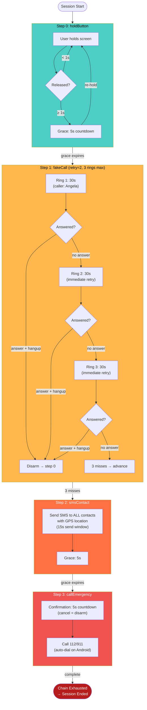
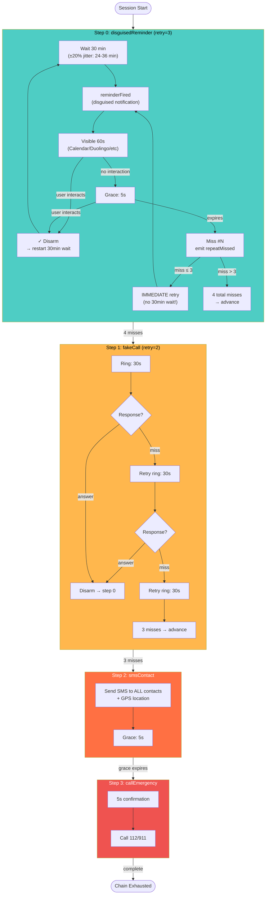
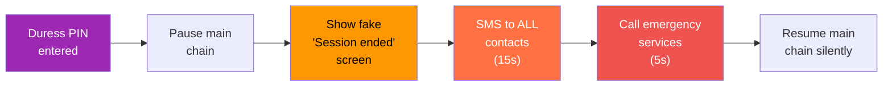
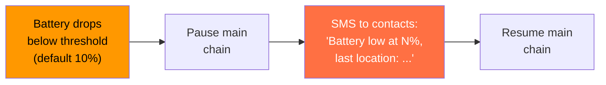
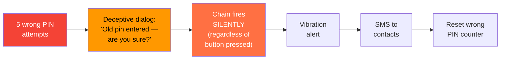

# Default Escalation Chains

## Walk Mode — Hold Button Check-in



### Walk Mode Timeline (worst case, no user response)

```
T+0s      User releases phone
T+1s      Sensitivity delay (1s)
T+6s      Grace expires (5s)  ─── ESCALATION BEGINS ───
T+6s      Fake call #1 starts ringing (30s)
T+41s     Fake call #1 missed (30s ring + 5s grace)
T+41s     Fake call #2 starts immediately
T+76s     Fake call #2 missed
T+76s     Fake call #3 starts immediately
T+111s    Fake call #3 missed → advance to SMS
T+111s    SMS sends to all contacts with GPS
T+131s    SMS step completes (15s + 5s grace)
T+131s    Emergency call confirmation (5s)
T+136s    112/911 dialed

Total: ~2 minutes 16 seconds from phone drop to emergency call
```

---

## Date Mode — Disguised Reminder Check-in



### Date Mode Timeline (user stops responding after T+30min)

```
T+0min     Session starts, 30min wait begins
T+30min    Reminder #1 fires (user confirms) → restart wait
T+60min    Reminder #2 fires (user confirms) → restart wait
T+90min    Reminder #3 fires ─── USER INCAPACITATED ───
T+91min    Reminder #3 missed (60s duration + 5s grace)

           ┌─── NEW BEHAVIOR: retries fire IMMEDIATELY ───┐
T+91min    Retry #1 fires immediately (no 30min wait!)
T+92min    Retry #1 missed (65s)
T+93min    Retry #2 fires immediately
T+94min    Retry #2 missed (65s)
T+95min    Retry #3 fires immediately
T+96min    Retry #3 missed → 4 total misses → ADVANCE
           └──────────────────────────────────────────────┘

T+96min    Fake call #1 starts ringing
T+97.5min  Fake call #1 missed (30s + 5s)
T+97.5min  Fake call #2 immediately
T+99min    Fake call #2 missed
T+99min    Fake call #3 immediately
T+100.5min Fake call #3 missed → advance to SMS
T+100.5min SMS sends to all contacts with GPS
T+101min   SMS completes → advance to emergency
T+101min   Emergency call confirmation (5s)
T+101.1min 112/911 dialed

From incapacitation (T+91min) to emergency call: ~10 minutes
OLD BEHAVIOR would have been: ~93 minutes (!)
```

---

## Sub-Chains

### Duress Chain (triggered by duress PIN)



### Battery Alert Chain (triggered at threshold %)



### Wrong PIN Chain (triggered after N wrong attempts)



---

## Chain Comparison

```
                    Walk Mode                     Date Mode
                    ─────────                     ─────────
Check-in:           Hold screen                   Respond to notification
Interval:           Continuous                    Every 30 min
Misses to escalate: 1 (immediate)                 4 (with immediate retries)
First escalation:   ~6s after release             ~5min after first miss
Emergency call:     ~2min 16s                     ~10min from incapacitation
Best for:           Walking home alone            On a date, at a bar
Hands:              One hand on phone             Phone in pocket/bag
```
