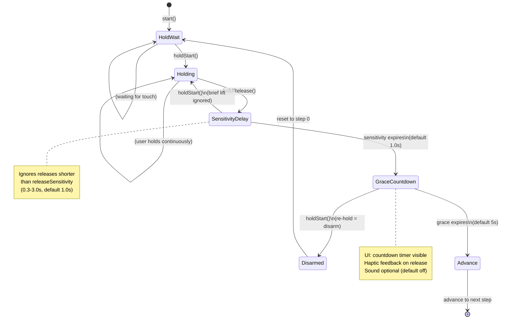
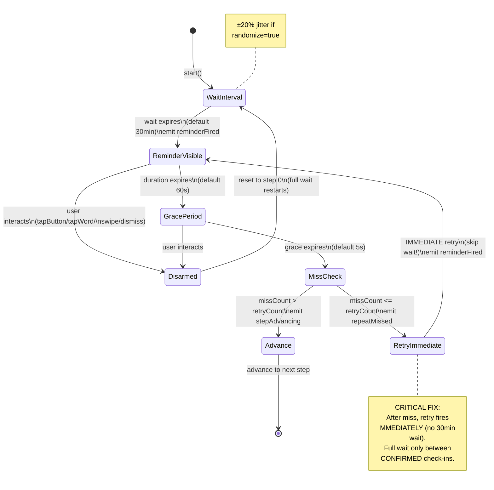
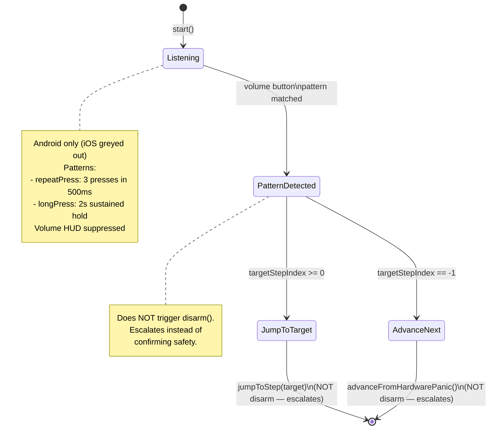
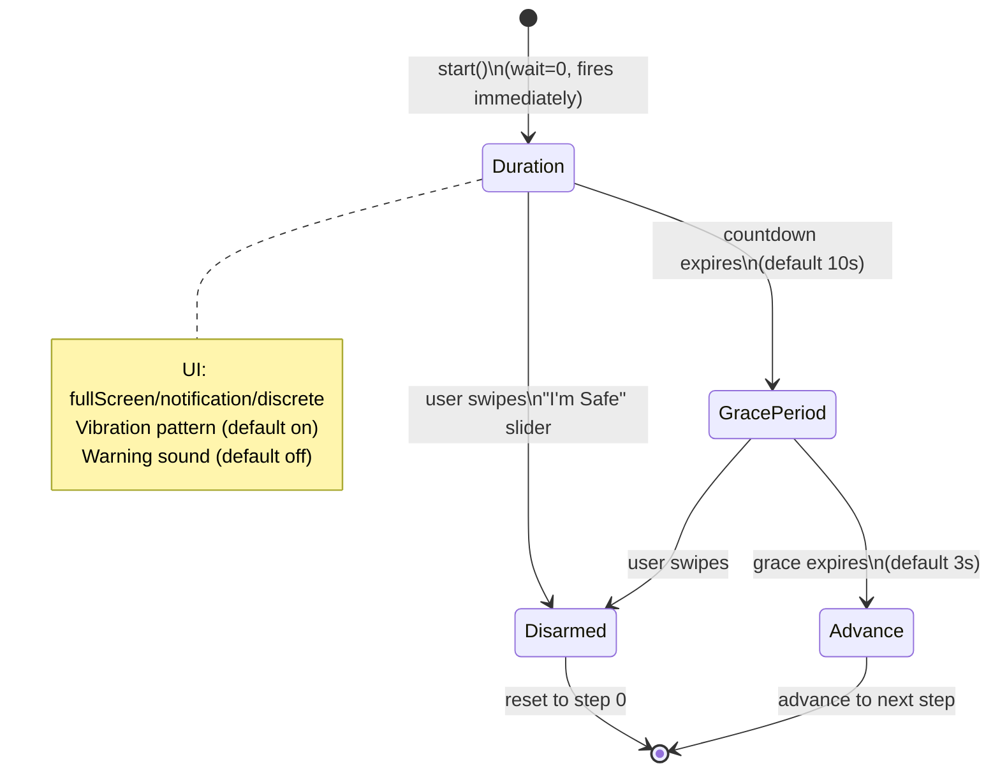
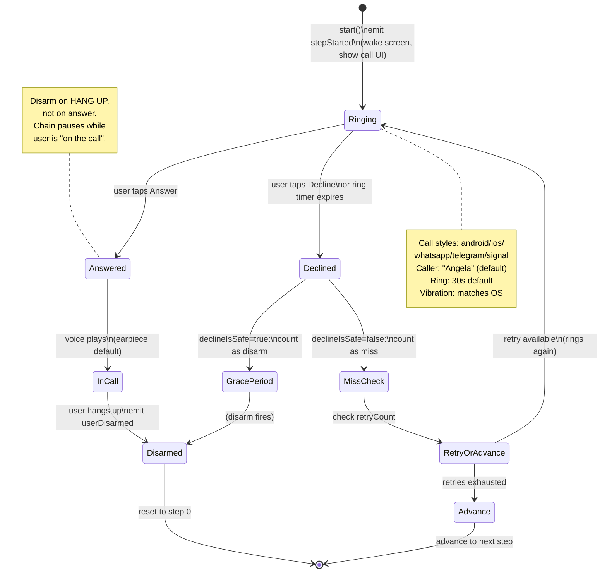
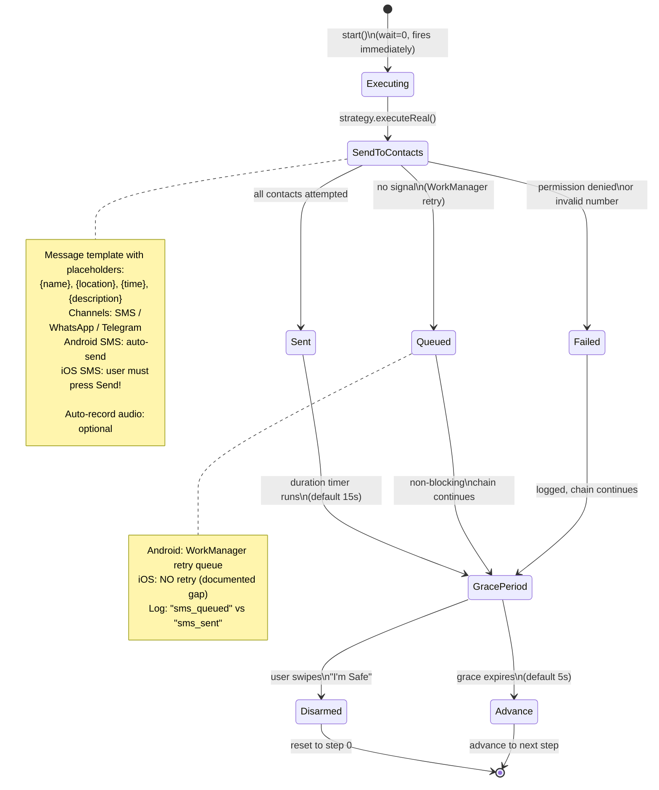
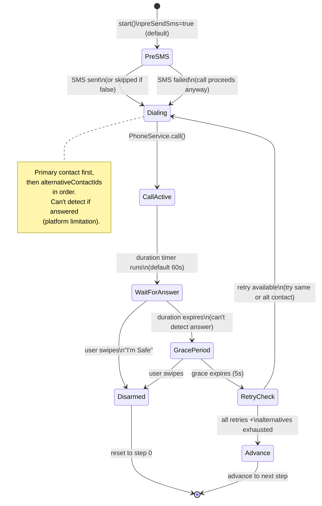
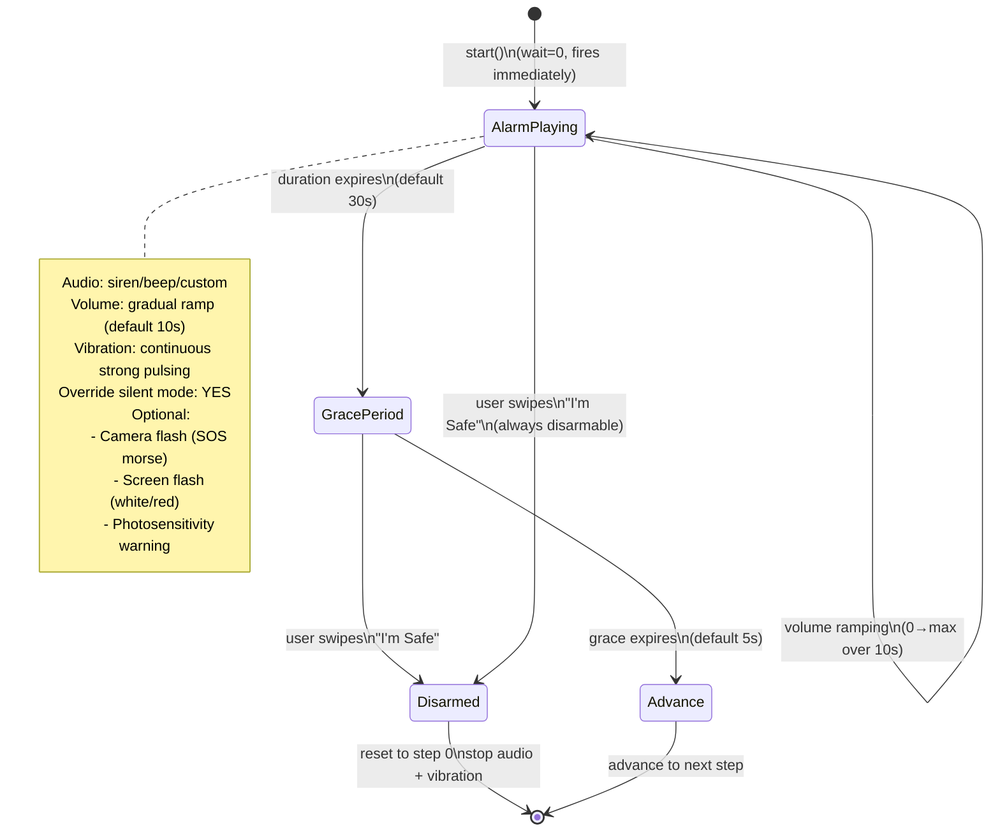
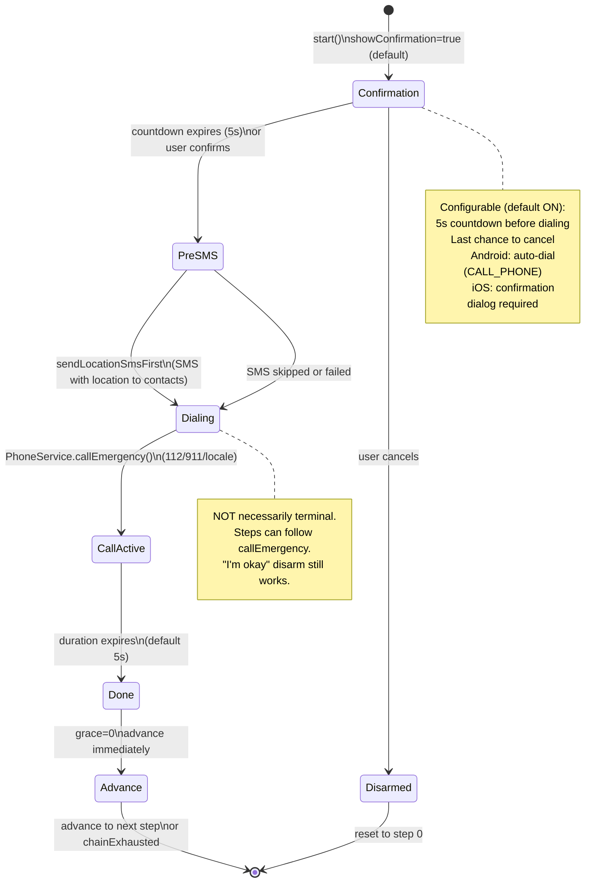
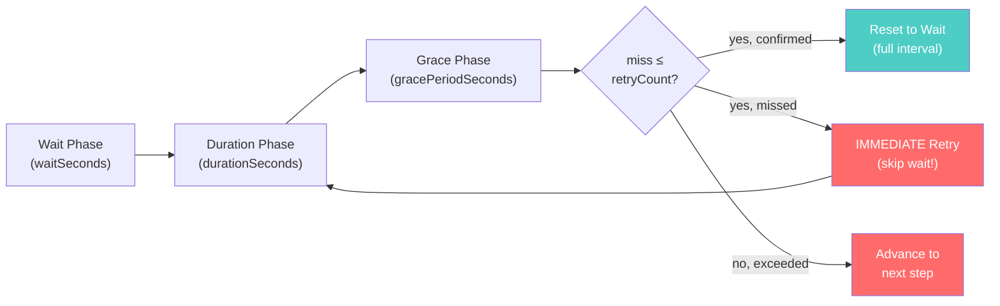

# Event Type Lifecycles

Each event type's state machine showing phases, transitions, and user interactions.

---

## 1. holdButton (Check-in)

**Timing:** wait=0, duration=10s (countdown), grace=5s | **Disarm:** re-hold | **Real action:** none (UI-only)

---

## 2. disguisedReminder (Check-in)

**Timing:** wait=1800s (30min), duration=60s, grace=5s, retry=3 | **Disarm:** interact with overlay | **Real action:** none (UI-only)

---

## 3. hardwareButton (Panic Trigger)

**Timing:** wait=0, duration=0, grace=0 | **No disarm** — this is an escalation trigger | **Real action:** none (platform key detection)

---

## 4. countdownWarning

**Timing:** wait=0, duration=10s, grace=3s | **Disarm:** swipe slider | **Real action:** vibration + optional sound

---

## 5. fakeCall

**Timing:** wait=0, duration=30s (ring), grace=5s, retry=2 | **Disarm:** answer then hang up (or decline if declineIsSafe=true) | **Real action:** none (UI-only fake call screen)

---

## 6. smsContact

**Timing:** wait=0, duration=15s, grace=5s | **Disarm:** swipe slider | **Real action:** MessagingService.sendToAll()

---

## 7. phoneCallContact

**Timing:** wait=0, duration=60s, grace=5s, retry=1 | **Disarm:** swipe slider | **Real action:** PhoneService.call() + optional pre-SMS

---

## 8. loudAlarm

**Timing:** wait=0, duration=30s, grace=5s | **Disarm:** always disarmable (swipe slider) | **Real action:** AudioService + VibrationService + optional FlashService

---

## 9. callEmergency

**Timing:** wait=0, duration=5s, grace=0 | **Disarm:** cancel during confirmation | **Real action:** PhoneService.callEmergency() + optional pre-SMS

---

## Universal Phase Model

All steps share this three-phase timing model:

