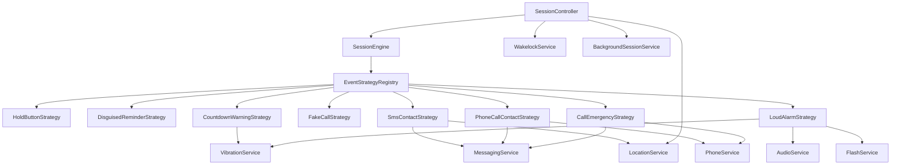

> **Normative status:** This document is NORMATIVE. In case of conflict
> with any other document (decisions log, audits, reviews), this document
> takes precedence. Key words "MUST", "SHOULD", "MAY" follow RFC 2119.

# 05 - Services Specification

All services are exposed as Riverpod `Provider<T>` singletons via `lib/services/service_providers.dart`. Services wrap platform APIs and hardware features for audio, location, messaging, vibration, and notifications.

---

## Service Architecture Overview



---

## AudioService

Plays ringtones for fake calls, alarm sounds, voice recordings, and manages audio output routing.

```dart
class AudioService {
  Future<void> playRingtone(String? assetPath);
  Future<void> playAlarm();
  Future<void> playAlarmWithConfig({
    String soundChoice = 'siren',
    String? customSoundPath,
    double volume = 1.0,
  });
  Future<void> playSound(String assetPath);
  Future<void> playVoiceRecording(String filePath);
  Future<void> stop();
}
```

### Ringtone Behavior

**`playRingtone(assetPath?)`**

Loops a ringtone sound indefinitely until stopped. Default asset depends on call style configuration:

- **android style** — Android default system ringtone asset
- **ios style** — iOS default system ringtone asset
- **whatsapp style** — WhatsApp notification ringtone asset
- **telegram style** — Telegram notification ringtone asset
- **signal style** — Signal notification ringtone asset

If `assetPath` is null, uses the call style's default ringtone. Custom ringtones can be loaded from file or asset paths.

### Alarm Behavior

**`playAlarm()`**

Plays the default alarm sound (siren) at maximum volume, looping indefinitely until stopped. On Android, uses the `STREAM_ALARM` audio stream to bypass silent and vibrate modes. A configurable toggle (default false per Q19) enables Do Not Disturb override, allowing the alarm to sound even during DND.

**`playAlarmWithConfig(soundChoice, customSoundPath, volume)`**

Plays an alarm with configurable parameters:

- **soundChoice**: `'siren'` (default) or `'custom'` only (Q9; matches `LoudAlarmSound` enum in 03)
- **customSoundPath**: filesystem path to a custom audio file (required if `soundChoice == 'custom'`)
- **volume**: 0.0–1.0 (clamped to valid range)

### Gradual Volume Increase

When enabled in settings, volume ramps linearly from 0 to the target volume over a configurable duration (default 5 seconds per Q33; configured via `AppSettings.alarmGradualVolumeDurationSeconds`). Implemented via `Timer.periodic(100ms)` to avoid abrupt loudness that could startle or cause audio feedback loops.

### System Volume Override

On Android, the app can temporarily set the system media stream to max volume before playing alarm or ringtone. This is controlled by a toggle in audio settings (default true). The system volume is restored after playback stops or the session ends.

> **Reconciliation note (M4 C5, 2026-06-09): media-stream override DESCOPED
> for GA.** The loud alarm already plays on `STREAM_ALARM` (see *Loud Alarm*
> above), which on Android is audible even in silent/vibrate mode and is
> governed by the alarm volume — not the media volume. Forcing the system
> *media* stream to max is therefore redundant for the alarm's audibility
> guarantee, while carrying the side-effect of overriding the user's media
> volume. The override is **not built for GA**; the `STREAM_ALARM` routing is
> the audibility mechanism. (The audio-settings toggle is reserved for a
> future revisit should a media-routed sound — e.g. a custom ringtone preview
> — ever need it.)

### Voice Recordings (Extra-32, C2)

**`playVoiceRecording(String? filePath, {bool useSpeaker = false, bool isSimulation = false})`**

Plays a voice recording once. The `filePath` parameter is now nullable:

- **`filePath != null`**: Plays the file at the given path (user-recorded, M4A/AAC-LC).
- **`filePath == null`**: Falls back to the built-in language-specific recording bundled with the app (see below).

**Built-in Voice Recordings (C2):**

14 built-in recordings covering all supported languages (generic "Hey, it's Angela, just checking in..." message).

**Asset path convention:** `assets/voice/angela_{languageCode}.m4a` where `{languageCode}` is an ISO 639-1 code (or `zh_TW` for Traditional Chinese). The map is declared once in `AudioService._builtInVoicePaths` — that Dart map is the single source of truth; keep it in sync with the table below and with the `flutter:` `assets:` manifest in `pubspec.yaml`.

| Language | Asset Path |
|----------|-----------|
| English (`en`) | `assets/voice/angela_en.m4a` |
| German (`de`) | `assets/voice/angela_de.m4a` |
| Spanish (`es`) | `assets/voice/angela_es.m4a` |
| French (`fr`) | `assets/voice/angela_fr.m4a` |
| Russian (`ru`) | `assets/voice/angela_ru.m4a` |
| Chinese Simplified (`zh`) | `assets/voice/angela_zh.m4a` |
| Chinese Traditional (`zh_TW`) | `assets/voice/angela_zh_TW.m4a` |
| Hindi (`hi`) | `assets/voice/angela_hi.m4a` |
| Farsi (`fa`) | `assets/voice/angela_fa.m4a` |
| Ukrainian (`uk`) | `assets/voice/angela_uk.m4a` |
| Polish (`pl`) | `assets/voice/angela_pl.m4a` |
| Greek (`el`) | `assets/voice/angela_el.m4a` |
| Arabic (`ar`) | `assets/voice/angela_ar.m4a` |
| Hebrew (`he`) | `assets/voice/angela_he.m4a` |

**Fallback resolution order:** when `playVoiceRecording(null)` is invoked, `AudioService._resolveBuiltInVoicePath` runs:

1. Read `Platform.localeName` (e.g. `"en_US"` or `"zh_TW"`).
2. If the full tag matches a map key (handles `zh_TW` directly), return it.
3. Otherwise split on `_` and match the language prefix (`en_US` → `en`).
4. If neither matches, return the English asset (`assets/voice/angela_en.m4a`) and log a warning with the original locale.

Missing asset files at runtime cause `just_audio.setAsset` to throw `PlayerException`, which is caught and logged; the caller's `playVoiceRecording` Future completes with the same exception so the upstream strategy can fall back to a disguised reminder or surface an error toast.

**Voice recording assets — TTS placeholder pipeline (D14, promoted from former deferred enhancement):**

All 14 M4A files are required at v3 GA. Because human voice talent recordings are out of scope for the engineering build, the app ships with a `flutter_tts`-based placeholder pipeline that synthesizes each clip on first launch:

1. On first launch (after `seedDefaults()` completes), `AudioService.bootstrapVoiceAssets()` runs in the background.
2. For each of the 14 locales, it picks an `Angela`-style line for the locale (canonical English text: *"Hey, it's Angela, just checking in. Can you call me back?"* — translated per locale via the same ARB strings used elsewhere) and calls `flutter_tts.synthesizeToFile()` to produce `assets/voice/angela_<lang>.m4a` in the app documents directory.
3. The fake-call step's voice playback first checks the documents directory; if no TTS clip is found there, it falls back to the bundled placeholder in `assets/voice/`. If neither exists, playback is silently skipped and the fake call still rings.
4. Users can record their own per-locale clips from Settings → Voice Recordings, which overrides the TTS placeholder.

The TTS pipeline runs once per locale; subsequent launches reuse the cached file. Failures are logged via Sentry but never block app start.

Default output routing is through the earpiece (receiver). A `useSpeaker` parameter routes playback through the speaker instead (useful for testing).

### Phone Ringer Mode Respect

All audio playback respects the device's ringer settings:

- **Silent mode** — no sound, except alarm (which overrides)
- **Vibrate mode** — no sound, except alarm (which overrides)
- **Volume mode** — respects system volume level

**Alarm Exception:** The loud alarm is the ONE exception that can override silent and vibrate modes, as it is designed as a last-resort attention-grabber for emergencies.

### Audio Ducking

- **Fake call fires** — pause any other audio (e.g., music, video) during the call to avoid interference
- **Alarm fires** — duck (reduce volume of) all other audio streams

### Cleanup

**`stop()`**

Stops playback and disposes the audio player. Safe to call multiple times.

---

## VibrationService

Provides haptic feedback patterns for different escalation events and user confirmations.

```dart
class VibrationService {
  Future<void> warningPattern();
  Future<void> confirmPulse();
  Future<void> alarmPattern();
  Future<void> fakeCallPattern();
  Future<void> reminderPattern();
  Future<void> cancel();
}
```

### Patterns

**`warningPattern()`**

Three quick pulses for countdown warning:
- 200ms on, 100ms gap, 200ms on, 100ms gap, 200ms on

**`confirmPulse()`**

Single 100ms pulse for check-in confirmation (e.g., button release, overlay dismiss).

**`alarmPattern()`**

Four sustained pulsing for loud alarm escalation:
- 500ms on, 200ms gap (repeats 4 times)

**`fakeCallPattern()`**

Realistic phone call vibration pattern matching the device OS (e.g., double pulse for incoming call).

**`reminderPattern()`**

Single short pulse imitating a real notification vibration.

**`cancel()`**

Stop all active vibration immediately.

### Ringer Mode Respect

All patterns respect the device's silent/vibrate settings, with one exception:

- **Alarm patterns** — ALWAYS vibrate, even in silent mode (cannot be disabled)

### Hardware Support

If the device lacks a vibrator (e.g., simulator, some tablets), all methods are no-ops.

---

## MessagingService

Sends SMS, WhatsApp, Telegram, and phone call messages to emergency contacts. Handles channel dispatch, phone number cleanup, and native Android SMS queueing.

```dart
class MessagingService {
  bool canAutoSend(MessageChannel channel);
  Future<MessageWorkId?> sendMessage({
    required EmergencyContact contact,
    required String message,
    bool isSimulation = false,
  });
  Future<void> cancelPending(List<MessageWorkId> workIds);
}
```

`sendMessage()` dispatches to the contact's channel(s). For Android SMS, it returns a `MessageWorkId` (the WorkManager job ID) that can later be passed to `cancelPending()`. Other channels return `null` (no cancellable background job).

### Single-Channel Dispatch Per Step (Extra-15)

Each `smsContact` chain step calls `sendMessage()` once per contact using only the **single channel** configured on that step (`SmsContactConfig.channel`). The strategy passes a single-channel `EmergencyContact.copyWith(channels: [channel])` to `sendMessage()`, preventing multi-channel dispatch from a single step.

### Cancel Pending SMS on Disarm (A5) — BUILT

**`MessagingServiceProtocol.cancelPending(List<MessageWorkId> workIds)`**

Cancels all queued WorkManager SMS jobs that have not yet been delivered. Called by `SessionController` when the user signals safety.

- **Purpose:** Prevents an unexpected distress SMS arriving minutes or hours after the user is safe (e.g., when the phone had no signal at send time and the SMS was queued for retry — see §SMS Retry Queue, up to 10 retries with exponential backoff).
- **Implementation:** Iterates the list and calls `WorkManager.getInstance().cancelWorkById(id)` for each ID via the `com.guardianangela.app/sms` MethodChannel (`SmsChannel.cancelWork`).
- **iOS:** No-op (iOS has no persistent WorkManager SMS queue). An empty `workIds` list and non-SMS channels are also no-ops (those channels return `null` from `sendMessage`, so no id is ever accumulated for them).

**Work-ID flow (as wired):**

1. `EventStrategy.executeReal()` returns `Future<List<MessageWorkId>>` — the SMS-sending strategies (`SmsContactStrategy`, and `CallEmergencyStrategy` when `sendLocationSmsFirst` is set) return the non-null `MessageWorkId`s of the jobs they enqueued; every other strategy and every short-circuit path returns `const []`.
2. `SessionController._dispatchStep()` accumulates each step's returned ids into a session-scoped `_smsWorkIds` list.
3. The controller passes that list to `cancelPending()` when **— and only when —** the user signals safety:
   - **`SessionController.disarm()`** (the "I'm safe" slider / hardware-button disarm) cancels immediately, then re-arms the engine to step 0 and clears the tracked list (a re-armed step that re-sends is tracked afresh).
   - A **clean session end** — `EndReason.disarm` (correct End-PIN) or `EndReason.userQuit` (explicit quit) — cancels via the safe-end branch of `SessionController._finaliseLog()`.
   - It is **NOT** cancelled on distress / escalation ends (`chainExhausted`, `hardwarePanic`, `duressPin`, `wrongPinExhausted`, `distressConfirmTimeout`): there the user is in danger and the message must still go out.

(There is no separate `SessionOrchestrator` / `cleanDisarm` / `registerSmsWorkId` type — the session orchestration is `SessionController`, and work-id capture is implicit in the `executeReal` return rather than a register call.)

### Channel Dispatch

Each contact has one or more messaging channels. `sendMessage()` dispatches to the channel specified by the caller.

#### SMS (Android Native)

**Android:** Uses native Kotlin `SmsManager.sendTextMessage()` via MethodChannel (`com.guardianangela.app/sms`). Auto-sends without user interaction.

**iOS:** Falls back to `sms:` URI + `url_launcher`, which opens the Messages app pre-filled. User must press Send (documented limitation).

#### SMS Retry Queue (Android) — Extra-40/45

On Android, native code implements a persistent retry queue for SMS delivery backed by a small Drift-side metadata table (`sms_retry_jobs`):

- **Native:** `SmsWorker` extends `CoroutineWorker` in Kotlin, uses `SmsManager` directly
- **Persistence:** WorkManager manages lifecycle; pending job metadata is mirrored into the Drift `sms_retry_jobs` table so the Dart layer can enumerate and cancel jobs (Extra-45)
- **Constraint:** `NetworkType.NOT_REQUIRED` — SMS sends over the cellular control channel and needs **no** validated data connection, so the worker MUST NOT wait for one. A cellular-but-no-data device (mobile data off, roaming, or a voice/SMS-only dead zone) must still deliver the distress SMS; the exponential backoff below covers a temporarily-unavailable radio. (Corrected post-Phase-7 review — the former `NetworkType.CONNECTED` could strand an emergency SMS indefinitely.)
- **Backoff:** Exponential backoff starting at 30 seconds, maximum 10 retries
- **Resilience:** Survives process death (WorkManager re-enqueues on device restart via `BootReceiver`)
- **Enqueue:** Exposed via MethodChannel `enqueueSms(phoneNumber, message)` which returns the WorkManager job ID
- **Cancellation:** Job IDs are stored in `sms_retry_jobs` and passed back to Dart as `MessageWorkId` strings; `cancelPending()` calls WorkManager cancellation via MethodChannel

**SMS Retry Exhaustion Notification (Extra 14/21):**

When `SmsWorker` exhausts all retries without delivering (10 attempts failed), it notifies the Dart layer via the `com.guardianangela.app/sms` MethodChannel using the `smsRetryExhausted` method. The payload carries `{workId, phoneNumber, contactName, message, error?}`.

**Dart-side API (contract):**
- `MessagingServiceProtocol.smsRetryExhausted` — broadcast `Stream<SmsRetryExhaustedEvent>` fired for every exhausted work item.
- `MessagingServiceProtocol.retryExhaustedSms(event)` — re-enqueue the same contact/message; returns the new `MessageWorkId`. Internally calls `sendMessage` so the new attempt gets the standard exponential back-off.
- `NotificationServiceProtocol.showSmsRetryExhaustedNotification({contactName, actionPayload})` — posts the system notification with a "Retry" action keyed by `kActionRetrySmsPrefix + actionPayload`. Controllers match on the prefix in the `actionTaps` stream to look up the cached `SmsRetryExhaustedEvent` and call `retryExhaustedSms`.

**Notification content:**
- **Android notification channel:** `ga_sms_retry` (High importance, distinct from the reminder channel so the user can mute retries without muting session reminders).
- **Title:** `"SMS to [Contact Name] never sent"`
- **Body:** `"Tap to retry manually."`
- **Action:** `"Retry"` button re-enqueues via `retryExhaustedSms`.

This notification is shown even if the session has already ended (the queued job is independent of the session lifecycle), so late-arriving retries are still surfaced.

**Native platform task:** the Kotlin `SmsWorker.doWork` MUST invoke the channel method that triggers `smsRetryExhausted` on the final failure path. `MainActivity` / `SmsChannel.kt` is the platform-side owner of this hop; the Dart side consumes the event via the `actionTaps` stream described above and re-enqueues through `retryExhaustedSms`.

#### WhatsApp

Opens `https://wa.me/{phoneNumber}?text={encodedMessage}` in the WhatsApp app (if installed). User must press Send.

#### Telegram

Attempts deep link `tg://msg?to={phoneNumber}&text={encodedMessage}`. Falls back to `https://t.me/{phoneNumber}` if the app is not installed.

#### Phone Call

Dispatched to `PhoneService.call()` (see Phone Service section).

### Phone Number Cleanup

All phone numbers are sanitized before use:

- Remove all non-digit characters (spaces, dashes, parentheses, etc.)
- Preserve leading `+` prefix for international numbers
- Example: `+1 (555) 123-4567` → `+15551234567`

### Automatic Send Capability

**`canAutoSend(channel)`**

Returns `true` only for SMS on Android (the only channel that truly auto-sends without user interaction). All other channels require user interaction or app installation.

---

## PhoneService

Initiates phone calls and emergency calls.

```dart
class PhoneService {
  Future<bool> callEmergency(String emergencyNumber);
  Future<bool> call(String phoneNumber);
}
```

### Emergency Call

**`callEmergency(emergencyNumber)`**

Dials an emergency number (e.g., "112", "911", "999") via `tel:` URI.

**Android:** Uses `ACTION_CALL` intent with `CALL_PHONE` permission. Auto-dials without confirmation.

**iOS:** `tel:` URI always shows a confirmation dialog before dialing (documented OS limitation).

### Regular Phone Call

**`call(phoneNumber)`**

Dials a regular phone number via `tel:` URI. Behavior matches emergency calls (confirmation dialog on iOS, auto-dial on Android).

### Phone Number Handling

Phone numbers are cleaned by removing non-digit characters while preserving the `+` prefix (same as MessagingService).

### Voice Call Deep Links

WhatsApp, Telegram, and Signal voice call deep links are **not supported** because they cannot initiate calls — they only open the app to the chat/profile page. Users must manually initiate calls from the app. For true auto-calling, only native phone calls are viable.

---

## LocationService

Tracks GPS location during sessions and provides location URLs for contact messages.

```dart
class LocationService {
  Future<bool> requestPermission();
  Future<void> startTracking({Duration interval = const Duration(seconds: 30)});
  void stopTracking();
  String? getLastLocationUrl();
  LocationPoint? getLastLocationPoint();
  LocationPoint? getLastLocationWithFallback();
  List<LocationPoint> get history;
  void clearHistory();
}
```

### Permissions

**`requestPermission()`**

Checks and requests location permission. Returns `true` if permission is granted (or was already granted). Returns `false` if permission is denied or location services are disabled on the device.

### Tracking

**`startTracking(interval)`**

Starts polling GPS location at the given interval (default 30 seconds). Uses high accuracy and a 10-meter distance filter to avoid logging redundant points.

Gets the initial position immediately, then subscribes to a position stream that fires when the user moves at least 10 meters or the interval elapses.

**`stopTracking()`**

Cancels the location stream subscription.

### Location Data Access

**`getLastLocationUrl()`**

Returns a Google Maps URL: `https://maps.google.com/?q=lat,lng`

Useful for including in emergency contact messages. Returns `null` if no position is available.

**`getLastLocationPoint()`**

Returns the last known `LocationPoint` with latitude, longitude, and timestamp.

**`getLastLocationWithFallback()`**

Returns the last known location. If the current location is unavailable, returns the previously known location with a timestamp note: `"Last known location at {timestamp}"`.

### Location History

**`history`**

Unmodifiable list of all tracked positions during the session (up to the bounded history limit).

**`clearHistory()`**

Wipes all logged positions.

### Bounded History

Location history is limited to a configurable maximum (default 1000 points). When the limit is reached, oldest points are discarded.

### Recording Modes

Location recording behavior is configurable via `AppDefaults.gpsLogging` (`GpsLoggingConfig`),
with optional per-mode override in `ModeOverrides.gpsLogging`:

- **On escalation steps only** (default) — GPS is recorded only when escalation events fire (e.g., fake call, SMS contact). Check-in and reminder events do not trigger GPS logging.
- **On all events** — GPS is recorded for every event, including reminders and check-ins.

### Permission Denial Handling

If location permission is denied or GPS is unavailable:

- Messages show "Location unavailable" instead of a URL
- Failure is logged but does not block the event chain
- Session continues normally

---

## WakelockService

Keeps the device screen on or off during sessions, supporting specific check-in styles.

```dart
class WakelockService {
  Future<void> enable();
  Future<void> disable();
  bool get isEnabled;
}
```

### Usage

**`enable()`**

Prevents the device from sleeping (keeps screen on).

**`disable()`**

Allows the device to sleep normally (screen can turn off).

**`isEnabled`**

Getter to check the current state.

### Use Cases

- **fakeLockScreen hold style** — keeps the screen on but at near-zero brightness during a hold-button check-in, simulating a real phone lock screen
- **Session active phase** — optional screen-on during walk mode to indicate the session is running

### Battery Consciousness

Wakelock is only active during specific check-in phases, not for the entire session. This balances safety (user can see the phone is active) with battery usage.

---

## ContactService

Read-only accessor over the persisted emergency-contact list. Used by
event strategies to resolve `SmsContactConfig.contactSelection`,
`SmsContactConfig.contactIds`, `PhoneCallContactConfig.contactId`, and
`PhoneCallContactConfig.alternativeContactIds`.

```dart
class ContactService {
  List<EmergencyContact> get all;
  EmergencyContact? byId(String id);
}
```

The protocol lives at `lib/services/protocols/contact_service_protocol.dart`
(Phase 3); Phase 5's concrete implementation wraps `ContactsRepository`
and pre-warms the in-memory cache at session start so strategies never
hit the DB during executeReal.

---

## RecordingService

Records audio to the app's documents directory. Recordings are referenced from the active `SessionLog` (the log's event entries carry the file path) and stored locally only — by design they are NOT attached to outbound messages (see spec 11 REJ-2).

```dart
class RecordingService {
  Future<String> startRecording({String? fileName});
  Future<String?> stopRecording();
  Future<String> recordForDuration({
    required Duration duration,
    String? fileName,
  });
  Future<void> dispose();

  bool get isRecording;
  String? get currentPath;
}
```

### Recording

**`startRecording(fileName?)`**

Starts recording audio to AAC-LC codec (M4A container). Default filename is `recording_{timestamp}.m4a` in the app documents directory. Returns the file path.

Throws `StateError` if microphone permission is not granted.

**`stopRecording()`**

Stops recording, saves the file, and returns the path. Safe to call if not recording (returns `null`).

**`startVoiceRecordingWithCap({maxDuration, fileName?})`** *(Extra 39)*

Starts a user-supplied voice recording for the fake-call feature with a hard duration cap. The cap is validated up-front (throws `ArgumentError` for durations > `kMaxVoiceRecordingDurationSeconds` (= 120) or non-positive), then the recorder auto-stops when the cap elapses.

- `kMaxVoiceRecordingDurationSeconds` is the single source of truth for the cap: **120 seconds (2 minutes)**.
- `validateVoiceRecordingDuration(duration)` is exported so UI code can pre-validate before calling into the recorder.
- The cap applies to both real recordings and simulation (in simulation the underlying recorder is a no-op but the validation still fires so invalid inputs are caught at dev time).

### Encryption and Privacy

Recordings are encrypted at rest using the same AES-256 key as the Drift database (managed by `EncryptionService`). Filenames use innocuous patterns (e.g., timestamps) to avoid revealing content.

### Limits

- **Max duration (Extra 39):** `kMaxVoiceRecordingDurationSeconds = 120` seconds. Enforced in [`audio_service_protocol.dart`](../lib/services/protocols/audio_service_protocol.dart); loud failure via `ArgumentError` on violation.
- **Codec:** AAC-LC (efficient compression)

### Legal Warning

A legal warning is displayed during app setup and before each session start:

> "Recording audio in conversations may be illegal in your jurisdiction. Check local laws before enabling this feature."

This warning is mandatory and configurable per region.

### Permissions

Microphone permission is requested **when the recording option is toggled on** in settings, not upfront during app launch. This reduces initial permission burden.

### Out-of-scope: video recording

v3 GA records audio only. Video recording is explicitly rejected (see spec 11 REJ-3) — storage cost, privacy considerations, and platform-permission overhead outweigh the marginal evidence value over audio + location.

---

## FlashService

Controls the device camera flashlight for SOS morse code signalling.

```dart
class FlashService {
  Future<void> startSosFlash();
  Future<void> startContinuousFlash();
  Future<void> stopFlash();
  bool get isFlashing;
}
```

### SOS Pattern

**`startSosFlash()`**

Flashes the camera LED in SOS morse code (··· −−− ···):

- **Dot (short flash):** 200 ms on
- **Dash (long flash):** 600 ms on
- **Inter-symbol gap:** 200 ms off
- **Inter-letter gap:** 600 ms off
- **Cycle gap:** 1 second (before repeating)

Loops continuously until `stopFlash()` is called.

### Continuous Pattern

**`startContinuousFlash()`**

Alternative strobe pattern (fast alternating flashes) for maximum attention-grabbing without morse timing constraints.

### Cleanup

**`stopFlash()`**

Stops the flash loop and releases the camera. Awaits the loop to exit before disposing the controller to prevent calling methods on a disposed resource.

Safe to call when not flashing.

### Graceful Degradation

If the camera is unavailable or permission is denied, the service silently degrades (no-op). Escalation continues without the flash component.

---

## ScreenFlashService

Full-screen white/red alternating overlay for visual alerting.

```dart
class ScreenFlashService {
  Future<void> startScreenFlash({String speed = 'slow'});
  Future<void> stopScreenFlash();
}
```

### Flash Speeds

- **fast:** 500 ms intervals (more attention-grabbing, higher seizure risk)
- **slow:** 1000 ms intervals (safer for photosensitive users, default when enabled)

### Overlay Rendering

An overlay widget (`ScreenFlashOverlay`) covers the entire screen and alternates between white and red backgrounds at the configured interval. Taps to the overlay are passed through to the app beneath (not modal).

### Photosensitivity Warning

When enabling screen flash in settings, a warning is shown:

> "Screen flashing may trigger photosensitive seizures. Use caution if you or anyone nearby has photosensitivity or epilepsy."

---

## HardwareButtonService

Detects volume button panic patterns and triggers escalation steps.

```dart
enum HardwareButtonType { volumeUp, volumeDown }
enum HardwareTriggerPattern { repeatPress, longPress }

class HardwarePanicEvent {
  final HardwareButtonType buttonType;
  final HardwareTriggerPattern pattern;
  final DateTime timestamp;
}

class HardwareButtonService {
  Stream<HardwarePanicEvent> get panicEvents;
  bool get isListening;

  void start({
    HardwareButtonType? buttonType,
    HardwareTriggerPattern? pattern,
    int? pressCount,
    int? pressWindowMs,
    double? longPressDurationSeconds,
  });
  void stop();
  void updateConfig({...});
  void dispose();
}
```

### Platform Support

**Android:** Full support via EventChannel interception in `MainActivity.dispatchKeyEvent()`. Volume up/down buttons are intercepted and suppressed.

**iOS (C1):** Partial support via the headphone remote (central play/pause button). Only wired or Bluetooth headphones that expose a media button are detected. The iOS volume buttons themselves cannot be intercepted programmatically. The headphone remote button is accessed via the `audio_service` package (present in `pubspec.yaml`) by registering a `BaseAudioHandler` subclass (`_GuardianAudioHandler`) that receives media callbacks from the OS. The handler overrides every callback that a typical remote may produce — `play()`, `pause()`, `skipToNext()`, `skipToPrevious()`, and the generic `click()` media-button handler — and routes each into the same press counter used by the Android path.

- Only the **repeat-press pattern** is available on iOS (the handler counts calls to `play()`/`pause()`/`skipToNext()`/`skipToPrevious()`/`click()` within the configured window).
- Long-press detection requires ACTION_DOWN/UP timestamps from the native layer, which are not available via the `audio_service` media button callbacks. Long-press is **not supported on iOS**.
- The `audio_service` handler is registered on `start()` and de-registered (set to null) on `stop()`.

### Android Implementation

The `MainActivity` intercepts volume key events via `dispatchKeyEvent()`:

- **Returns true** (consumed) for volume key events WITHOUT calling `super.dispatchKeyEvent()`
- This suppresses **both** the volume change AND the system volume HUD
- The user's volume setting remains unchanged (no need to restore)
- User cannot change system volume while a session is active (acceptable tradeoff for safety)

### iOS Implementation (C1)

```dart
Future<void> _startIos() async {
  _iosHandler = await AudioService.init<_GuardianAudioHandler>(
    builder: () => _GuardianAudioHandler(onPress: _onIosButtonPress),
    config: AudioServiceConfig(
      androidNotificationChannelId: 'com.guardianangela.app.session_service',
      androidNotificationChannelName: 'Session',
    ),
  );
}
```

`_GuardianAudioHandler` overrides `play()`, `pause()`, `skipToNext()`, `skipToPrevious()`, and `click()` — every remote command that iOS emits for a headphone button press — and calls `onPress()` for each. `onPress()` drives the same `_handleRepeatPress()` counting logic as the Android implementation. On `stop()`, `_iosHandler` is set to null; there is no public unregister API in `audio_service`.

### Detection Patterns

#### Repeat Press Pattern

Counts the number of volume button presses within a time window (default: 5 presses in 500 ms).

When the required count is reached within the window, fires `HardwarePanicEvent`.

#### Long Press Pattern

Detects a sustained hold of the volume button (default: 2 seconds).

When the duration is exceeded, fires `HardwarePanicEvent`.

#### Configuration

```dart
hardwareButtonService.start(
  buttonType: HardwareButtonType.volumeUp,
  pattern: HardwareTriggerPattern.repeatPress,
  pressCount: 5,           // 2-10 presses required
  pressWindowMs: 500,      // Window duration (200-2000 ms)
);
```

Or for long press:

```dart
hardwareButtonService.start(
  buttonType: HardwareButtonType.volumeUp,
  pattern: HardwareTriggerPattern.longPress,
  longPressDurationSeconds: 2.0,  // 1-10 seconds
);
```

### Test/Preview Mode

In settings, a test/preview mode detects button presses and shows "Button press detected!" feedback without triggering escalation. Useful for verifying the button configuration before a real session.

### Stream-Based API

Panic events are emitted via a broadcast stream. Multiple listeners can subscribe:

```dart
hardwareButtonService.panicEvents.listen((event) {
  // React to panic event
  sessionEngine.advanceChain();
});
```

---

## BackgroundSessionService (Foreground Service)

Manages the Android foreground service and iOS background execution to keep the app alive during active sessions. Provides persistent notification with action buttons.

```dart
class BackgroundSessionService {
  Future<void> configure();
  
  Stream<void> get onImSafe;
  Stream<void> get onPause;
  Stream<void> get onResume;

  Future<void> startService({...});
  Future<void> updateNotification({...});
  Future<void> stopService();
}
```

### Initialization

**`configure()`**

Must be called once at app startup (in `main()`). Sets up notification channels and initializes the background service.

### Notification Channels

| Channel | Name | Importance | Purpose |
|---|---|---|---|
| `session_service` | System Service | Low | Foreground service notification (persistent) |
| `reminders` | Reminders | High | Disguised reminder notifications |
| `alarm` | Alerts | Max | Alarm/emergency notifications, critical alerts |
| `updates` | Updates | Default | App updates and info notifications |

### Notification UI

#### Normal Mode

- **Title:** "Guardian Angela is active"
- **Body:** Current session info (time elapsed, step name)
- **Actions:**
  - **"I'm Safe"** button — fires `onImSafe` stream, triggers session check-in
  - **"Pause"** / **"Play"** button — toggles timer pause, fires `onPause` / `onResume` streams

#### Stealth Mode

- **Title:** Configurable disguise text (default: "Music playing")
- **Icon:** Neutral preset (music player, calendar, etc.), configurable
- **Body:** Minimal info to avoid suspicion
- **Actions:**
  - **"Pause"** / **"Play"** — toggle pause
  - Optional small app icon in corner (toggleable in stealth settings)

### Pause/Resume Behavior

**Pause:**
- Updates notification text to "Session paused" or "Music paused" (stealth)
- Pauses all engine timers (no escalation during pause)
- Fires `onPause` stream

**Resume:**
- Resumes all engine timers from where they paused
- Updates notification text back to active state
- Fires `onResume` stream

### Background Reminders

Disguised reminders are shown as system notifications (or full-screen intent for fullScreen style):

- **Simple types** (calendar, delivery, etc.) — tap to dismiss = check-in
- **tapWord style** — tap opens the word-tapping overlay for word authentication

### Disguised Reminder on Locked Device (Extra 35)

Every disguised reminder uses the maximum-urgency notification
tier so it still surfaces when the device is locked. On Android
this means:

- `Importance.max` channel (`reminders`)
- `Priority.max`
- `fullScreenIntent: true` — kicks the OS into showing the
  reminder as a full-screen intent while the screen is locked,
  waking the device. Requires `USE_FULL_SCREEN_INTENT` permission
  (Android 14+ prompts the user the first time the channel is
  used).
- `AndroidNotificationCategory.alarm` — exempt from app standby
  buckets.
- `NotificationVisibility.public` — fully readable on the lock
  screen (subject to the user's system privacy setting).

On iOS the same reminder is tagged as
`InterruptionLevel.timeSensitive` so it breaks through Focus and
DND filters. Critical-alert interruption remains reserved for
true escalation steps (alarm, emergency call).

Callers do not opt in. Every call to
`NotificationServiceProtocol.showDisguisedReminder` sets the
flags — users cannot silently miss a disguised reminder because
the device happened to be locked.

### iOS Background Modes

iOS uses background execution modes and `DarwinNotificationDetails`:

- **requestAlertPermission:** true
- **requestSoundPermission:** true
- **requestBadgePermission:** true
- **criticalAlert:** true (for escalation notifications, requires entitlement)

### iOS Critical Alert Entitlement

To send critical alerts that bypass Do Not Disturb, the app must be provisioned with `com.apple.developer.usernotifications.critical-alerts` entitlement. Once provisioned, use:

```dart
DarwinNotificationDetails(criticalAlert: true, sound: 'critical_alert.wav')
```

in escalation notifications (fake call, alarm, emergency).

### Android Do Not Disturb Override

On Android, a configurable toggle (default true) enables Do Not Disturb override:

- Uses `IMPORTANCE_HIGH` channel importance
- Sets full-screen intent on escalation notifications
- Wakes the screen and shows notifications even in DND mode
- Configurable per region/device policy

### Service Resilience

**START_STICKY:** The Android foreground service uses `Service.START_STICKY`, which ensures auto-restart after OOM (out-of-memory) kill or system termination. The notification persists until the app explicitly stops the service.

---

## Simulation Strategy Pattern

The simulation system uses a defense-in-depth strategy to prevent accidental triggering of real emergency actions during testing and demonstration.

### Layers of Protection

**Layer 1: Engine Flag Immutability**

The `SessionEngine` receives `isSimulation` as a final, immutable flag set at initialization. This flag cannot be changed during the session lifetime.

**Layer 2: Strategy Execution Guards**

Every `EventStrategy.executeReal()` method checks `isSimulation` first. If true, the method logs the action as `sim_blocked` and returns without executing the real escalation step.

**Layer 3: External Service Isolation**

Every external-facing service method (SMS, phone, audio) accepts `isSimulation` as a parameter. When true, the method logs the call but performs no actual action:

- `MessagingService.sendMessage(contact, message, isSimulation: true)` — logs but sends nothing
- `PhoneService.call(number, isSimulation: true)` — logs but dials nothing
- `AudioService.playAlarm(isSimulation: true)` — logs but produces no sound

**Layer 4: Service Subclasses**

For maximum safety, separate service subclasses exist for simulation:

- `SimulationMessagingService` — overrides all external methods to no-op with logging
- `SimulationPhoneService` — overrides all external methods to no-op with logging

The event strategy registry instantiates the appropriate service based on `isSimulation`.

This architecture makes it **structurally impossible** to reach real SMS/call code during simulation mode.

### Simulation Mode Principle — Practice Mode with Identical UI

**Simulation is a practice mode, not automated playback.** The user interacts with every step exactly as in a real session. The engine runs the same timing logic; the user must hold the button, answer or decline fake calls, and dismiss disguised reminders. If the user does not interact, the chain stalls and escalates on timeout — exactly as in real mode. The only differences from real mode are: destructive external actions are blocked, speed can be accelerated, and a Silent toggle suppresses audio.

**This principle applies to UI rendering without exception:** Simulation MUST render the exact same step UIs as real mode. The only UI differences are: blocked external actions (SMS, calls, loud alarm) display a `[SIM]` informational card instead of executing, and a `[SIM]` prefix appears in notifications. The simulation controls bar is overlaid separately at the bottom and never replaces session UI.

Per-step UI requirements:
- **holdButton** — Identical hold button UI with color transitions, timer-driven countdown number, and circular progress indicator. User must hold the button.
- **disguisedReminder** — The actual full-screen overlay or notification MUST appear. Notification shows `[SIM]` prefix. User must interact to disarm. A text toast is NOT acceptable.
- **countdownWarning** — The actual countdown UI with vibration (and audio if Silent is OFF) MUST fire. A text toast is NOT acceptable.
- **fakeCall** — The full `FakeCallScreen` MUST appear with ringtone (unless Silent is ON), answer/decline slider, caller avatar, and voice recording. The `[SIM]` marker appears in the caller name area. User must answer or decline. Skipping the FakeCallScreen in simulation is NOT acceptable.
- **smsContact / phoneCallContact / callEmergency** — These are blocked. A `[SIM] Would send SMS to 3 contacts` informational card appears. The card is shown IN ADDITION to any applicable session UI, never replacing it. Engine auto-advances after the step duration.
- **loudAlarm** — Always muted in simulation. A `[SIM]` card shows "Alarm would have sounded at full volume". Vibration still fires.

The `SimulationMessagingService` and `SimulationPhoneService` subclasses MUST NOT affect any UI rendering — they only prevent external I/O. UI code must not branch on `isSimulation` to show simplified or placeholder views.

### Silent Toggle in Simulation

An optional per-session toggle (not persisted) in the simulation controls bar. Defaults to OFF at the start of every simulation.

| Step Type | Real Mode | Sim (Silent=OFF, default) | Sim (Silent=ON) |
|-----------|-----------|---------------------------|-----------------|
| holdButton | UI only | UI only | UI only |
| disguisedReminder | UI + notification | UI + notification ([SIM] suffix) | UI + notification (silent, [SIM] suffix) |
| countdownWarning | UI + vibration + optional audio | UI + vibration + optional audio | UI + vibration only |
| fakeCall | Ring + vibration + call UI | Ring + vibration + call UI ([SIM] badge) | Vibration + call UI only (no ring, no voice) |
| smsContact | SMS sent | Blocked — [SIM] card shown | Blocked — [SIM] card shown |
| phoneCallContact | Phone dialed | Blocked — [SIM] card shown | Blocked — [SIM] card shown |
| loudAlarm | Full volume alarm | Muted — [SIM] card shown | Muted — [SIM] card shown |
| callEmergency | 112/911 dialed | Blocked — [SIM] card shown | Blocked — [SIM] card shown |
| hardwareButton | Native detection | Native detection | Native detection |

### What Fires Normally in Simulation (Silent=OFF)

The following actions execute as if in a real session:

- **Foreground service notification** — Shows title "SIMULATION — [mode name]" (cannot be hidden)
- **Disguised reminder overlays and notifications** — Actual reminder UI fires with `[SIM]` suffix on notification text
- **Fake call screen + ringtone + voice** — Full fake call UX (with simulation indicator)
- **Countdown warning UI + vibration** — Actual countdown UI with haptic pattern fires normally
- **Location tracking** — GPS is sampled and logged (for testing location inclusion in messages)

### What Is Blocked in Simulation (Both Silent Modes)

The following actions are completely blocked and logged as `sim_blocked`:

- **SMS messages** — To any contact
- **WhatsApp/Telegram/Signal messages** — To any contact
- **Phone calls to emergency contacts** — Via native calling
- **Emergency calls (112, 911, 999, etc.)** — Via native calling
- **Loud alarm audio** — Always muted; notification shown: "Alarm would have sounded at full volume"
- **Audio recording** — Blocked for privacy

### Simulation Indicators

Users and bystanders must always know a session is a simulation.

#### In-App Indicator

- **Orange border** around the session screen (always visible, cannot be hidden)
- **"SIMULATION" banner** at the top of the session UI (always visible, cannot be hidden)

#### Notification Indicator

- **Foreground service:** Title includes `[SIM]` prefix and "SIMULATION"
- **Disguised reminders:** Show `[SIM]` prefix and `— SIM` suffix on the notification

#### Stealth Simulation Indicator

When stealth mode is enabled during simulation:

- Instead of an orange border, a **SIM watermark** appears in the corners of the session screen
- Stealth disguise is fully tested (notification uses stealth text, neutral icon, etc.)
- `[SIM]` indicators remain in notifications only (not in stealth UI)
- Tests that the stealth appearance works correctly while still flagging the simulation

#### No System Overlay

The app does NOT use `SYSTEM_ALERT_WINDOW` permission to create a system-level simulation indicator (e.g., floating label). This avoids Play Store policy violations and maintains a clean permission model.

---

## BackupService

Exports and imports session data, contacts, modes, and settings.

```dart
class BackupService {
  Future<String> exportToJson({
    bool includeSessionLogs = true,  // Default: true
    bool includeMedia = true,        // Default: true
  });
  Future<void> importFromJson(String jsonString);
}
```

### Export Format

`exportToJson({includeSessionLogs, includeMedia})` assembles all repositories into a JSON structure:

```json
{
  "version": "1.0",
  "timestamp": "2024-04-02T12:00:00Z",
  "contacts": [...],
  "modes": [...],
  "settings": {...},
  "templates": [...],
  "eventDefaults": {...},
  "profile": {...},
  "sessionLogs": [...]   // omitted when includeSessionLogs: false
}
```

When `includeSessionLogs` is `false`, the `sessionLogs` key is omitted entirely. This produces a smaller backup with no location data, suitable for sharing settings without privacy concerns.

When `includeMedia` is `false`, audio recordings and profile photos are omitted from the export.

### Sharing

Export is triggered via `share_plus` package, which shows the OS share sheet (AirDrop on iOS, Share menu on Android).

### Import Validation

**`importFromJson(jsonString)`**

Parses and validates the JSON:

- **Schema version check:** Rejects exports whose `_schemaVersion` is greater than the running app's `AppConstants.currentSchemaVersion` (forward-incompatible payload)
- **Format validation:** Rejects malformed JSON
- **Type checking:** Validates all nested objects

On success, writes all data to the Drift database and JSON-backed singletons, overwriting existing data inside a single transaction.

On failure, throws an exception with a descriptive message and does NOT modify existing data.

### Media Inclusion

Optional toggle to include media (audio recordings, photos) in the export. Default is on. Large backups may take longer to share.

---

## SessionLogRecorder

Persists session timeline events emitted by the engine into a
`SessionLog`. Owned by `SessionController`; one recorder per session.

```dart
class SessionLogRecorder {
  SessionLogRecorder({
    required SessionContext context,
    required SessionLogRepository repo,
  });

  void onEvent(ChainEventData event);   // append to in-memory log
  Future<void> finalise(EndReason r);   // single atomic write
}
```

- **Subscribes** to `engine.events` on session start and appends one
  `SessionLogEvent` per step transition. No partial writes.
- **Stamps `hadMedicalInfo` at log creation** from the resolved
  `SessionContext`: true iff the user profile carries any medical
  field AND at least one step in the chain has
  `SmsContactConfig.includeMedicalInfo = true`.
- **Single atomic write** on `sessionEnded`: the populated log is
  persisted in one repository call. There is no incremental
  persistence — process kill mid-session = log is lost (matches
  the no-session-restore policy).

---

## Permission Audit Flow

One normative subsection for when permissions are checked,
re-requested, and how revocation mid-session is handled.

**Lifecycle:**

1. **Cold start** — only the always-required notification permission
   is requested. The home screen surfaces a checklist for any other
   permissions the user is likely to need; nothing is requested
   eagerly.
2. **Session start (real or simulation)** — `SessionController` calls
   `PermissionService.auditForMode(mode)`. The auditor inspects only
   what THIS mode needs:
   - SMS / WhatsApp / Telegram permissions iff `mode.chainSteps`
     contains an `smsContact` step.
   - Phone permissions iff `mode.chainSteps` contains
     `phoneCallContact` or `callEmergency`.
   - Location iff `mode.trackingEnabled` is true OR any
     `disarmTriggers` entry is a `GpsArrivalDisarmTrigger`.
   - Microphone iff any step opts in to `autoRecordAudio`.
   - Camera iff any `loudAlarm` step has `flashLight = true`.
   Missing permissions block real-session start (validation error)
   and warn-but-allow simulation start.
3. **Mid-session revocation** — `PermissionService` listens for
   OS-level revocation. Revocation is recorded as a
   `SessionLogEvent` with `eventType: 'permission_revoked'` and the
   session **continues**. The step that needs the missing permission
   logs `deliveryStatus: 'failed'` (or `'no_signal'` for SMS) on its
   next attempt; the chain advances per the standard non-blocking
   failure rule.

---

## SessionStartValidator

Validates session prerequisites before allowing a session to start.

```dart
class SessionStartValidator {
  ValidationResult validate(SessionMode mode);
}

class ValidationResult {
  bool get isValid;
  List<ValidationIssue> get errors;
  List<ValidationIssue> get warnings;
}

class ValidationIssue {
  final String title;
  final String description;
  final String? actionLabel;
  final VoidCallback? action;
}
```

### Validation Checks

1. **Notification permission** — Required (must be granted before session starts)
2. **Emergency contacts** — Warning if chain includes `smsContact` or `phoneCallContact` but no contacts are configured
3. **Required apps installed** — Check if WhatsApp/Telegram/Signal are installed before session start if chain uses those channels
4. **Emergency number** — Required if chain includes `callEmergency`
5. **Location permission** — Required if chain includes steps with `includeLocation` flag
6. **SMS/Phone permissions** — Required for `smsContact`, `phoneCallContact`, `callEmergency`
7. **Microphone permission** — Required if `autoRecordAudio` is enabled
8. **Battery optimization** — Warning (not blocking) if the app is not whitelisted from battery optimization

### Action Buttons

Issues include action buttons to resolve them:

- **"Add Contact"** — Opens contact manager
- **"Grant Permission"** — Opens system permission dialog
- **"Edit Mode"** — Opens mode editor to remove unsupported steps
- **"Back"** — Dismisses the validator

### Result Handling

`validate()` returns:

- **isValid = true** — All critical checks passed; session can start
- **errors** — Critical issues that prevent session start
- **warnings** — Non-critical but important (e.g., no contacts, app not whitelisted from battery optimization)

UI shows errors and blocks session start, shows warnings but allows user to proceed.

---

## EncryptionService

Manages the AES-256 key lifecycle for encrypted local storage (Drift database via `sqlite3mc`, JSON-backed singletons via an envelope using the same key).

```dart
class EncryptionService {
  Future<Uint8List> generateKey();
  Future<Uint8List?> getKey();
  Future<void> saveKey(Uint8List key);
  Future<DatabaseConnection> openEncryptedDatabase(String path);
  Future<Uint8List> decryptJsonBlob(Uint8List ciphertext);
  Future<Uint8List> encryptJsonBlob(Uint8List plaintext);
}
```

### Key Generation

**`generateKey()`**

Generates a cryptographically secure random 256-bit AES key on first app launch (32 bytes from a CSPRNG; never derived from a password).

### Key Storage

**`getKey()`**

Retrieves the key from `flutter_secure_storage` (encrypted in the OS keychain/Keystore).

### Database Encryption

**`openEncryptedDatabase(path)`**

Opens the Drift database file at `path` using a `sqlite3mc`-backed `DatabaseConnection`. Sets `PRAGMA key = ...` with the secure-storage key before any read or write.

### Always Encrypted

The Drift database file and every JSON-backed singleton are **always encrypted** — there is no opt-out. This ensures session logs, contacts, and settings are protected at rest.

---

## Notification Channel Architecture

Guardian Angela uses four distinct notification channels for different types of alerts:

| Channel ID | Display Name | Android Importance | iOS Sound | Purpose | Examples |
|---|---|---|---|---|---|
| `session_service` | System Service | Low | None | Foreground service persistent notification | Active session banner |
| `reminders` | Reminders | High | Yes | Disguised reminders and check-in prompts | "New Duolingo lesson", calendar event |
| `alarm` | Alerts | Max | Critical | Urgent escalation and emergencies | Fake call, alarm, emergency 112 |
| `updates` | Updates | Default | Yes | App updates and general info | Version update available |

### Channel Naming

Channel names are innocuous (not "Safety Alerts" or "Panic"):

- **Normal mode:** Descriptive (e.g., "Reminders", "System Service")
- **Stealth mode:** Uses the same channel but notification text is disguised

---

## Service Providers

All services are instantiated as Riverpod providers in
`lib/services/service_providers.dart`. Abstract protocol interfaces
live at `lib/services/protocols/<service>_protocol.dart` (Phase 3);
concrete implementations at `lib/services/<service>.dart` (Phase 5);
simulation stubs at `lib/services/sim/<service>.dart` (Phase 5).

No `Real*Service` constructor may be called outside
`lib/services/service_providers.dart` (CI grep enforces).

```dart
final audioServiceProvider = Provider((_) => AudioService());
final backgroundServiceProvider = Provider((_) => BackgroundSessionService());
final flashServiceProvider = Provider((_) => FlashService());
final hardwareButtonServiceProvider = Provider((_) => HardwareButtonService());
final locationServiceProvider = Provider((_) => LocationService());
final messagingServiceProvider = Provider((_) => MessagingService());
final phoneServiceProvider = Provider((_) => PhoneService());
final recordingServiceProvider = Provider((_) => RecordingService());
final screenFlashServiceProvider = Provider((_) => ScreenFlashService());
final vibrationServiceProvider = Provider((_) => VibrationService());
final wakelockServiceProvider = Provider((_) => WakelockService());
```

Services are singletons — the provider creates an instance once and reuses it throughout the app lifetime.

### Accessing Services

In controllers and event strategies:

```dart
final audioService = ref.read(audioServiceProvider);
await audioService.playAlarm();
```

---

## Error Handling Strategy

All services degrade gracefully on error:

- **Missing permission** — Log and skip (continue chain)
- **Unavailable hardware** — No-op (e.g., no camera = no flash)
- **Network unavailable** — Retry queue (SMS only)
- **App not installed** — Fall back to alternative channel or fail silently

No chain is blocked by service failures. If SMS fails, the chain continues. If location is unavailable, messages show "Location unavailable" instead of a URL. If the alarm fails to play, vibration patterns still fire.

This ensures safety is never compromised by service unavailability.

---

## Testing Services

Services should be tested in isolation with fakes/stubs:

- **AudioService** — Stub to record `playAlarm()` calls without actual audio
- **LocationService** — Fake returns pre-configured GPS points
- **MessagingService** — Stub logs messages instead of sending
- **VibrationService** — No-op in tests (no device vibrator needed)

For integration tests, use real services with test contacts and location coordinates.

Use `fakeAsync()` wrapper to control timers in background service tests.
